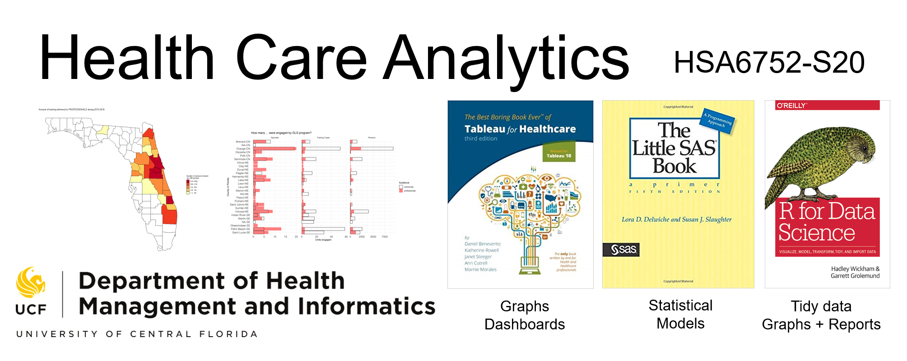

Health Care Analytis
===================
Repository to accompany HSA6752 Course at the University of Central Florida in the Spring of 2020. 

# Course catalog description 
Computer-based course focusing on analyzing health care data, including using data for decision making, process improvements, efficient health care delivery and preparing reports for other managers.  

# Course synopsis
The course focuses on developing practical skills for conducting analytic projects in applied health care settings. Provided with a realistic health-related data, learners will organize and carry out a real-world analytic project, requiring engagement of three software packages: Tableau, SAS,  and R. Learners will develop a practical familiarity with each of these three software and create a solid foundation to continue improving their technical skills in a real-world setting, guided by the demands of their jobs. 
Learners will develop a broad understanding of the issues and challenges typically encountered during an analytic project involving health data. The course will focus on three broad technical aspects: data wrangling, statistical modeling, and data visualization. This course will prioritize developing intuition for debugging during all three stages of analysis, preparing learners to tackle unforeseen complications with “messy” data in a real-world setting. 
After completing this course, learners will be equipped with practical skills of organizing operations with data into analytic workflows that connect observed data to decisions and recommendations, the foundation of modern evidence-based health care. 

# Learning Objectives

By the end of the course learners are expected to demonstrate their proficiency at:
1.	Developing pathways for inputting data from flat sources(.csv, .txt, .xlsx) into three analytic environments: Tableau, SAS, R
2.	Investigating errors during data input
3.	Making graphs using Tableau and R to support data exploration and decision making
4.	Evaluating the degree of missingness in the data and display its patterns
5.	Executing rescaling of measures and transformation of data types
6.	Constructing custom wide-to-long and long-to-wide data transformations 
7.	Applying basic statistical models to answer questions about the data (within the limits of general linear model)
8.	Assembling tables of results and output them into flat files (.cvs)
9.	Organizing the workflow of analytic projects
10.	Generating reporting documents that host tables and graphs from analytic activities
