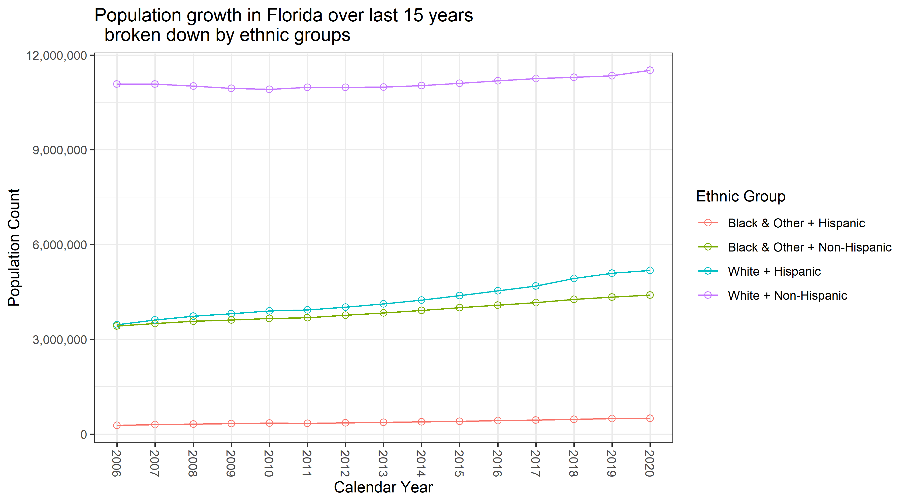
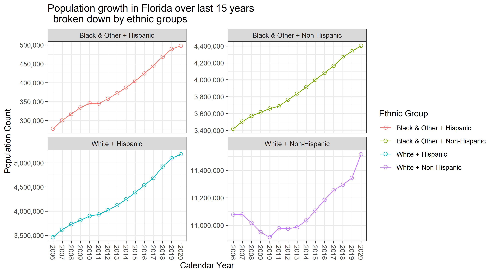
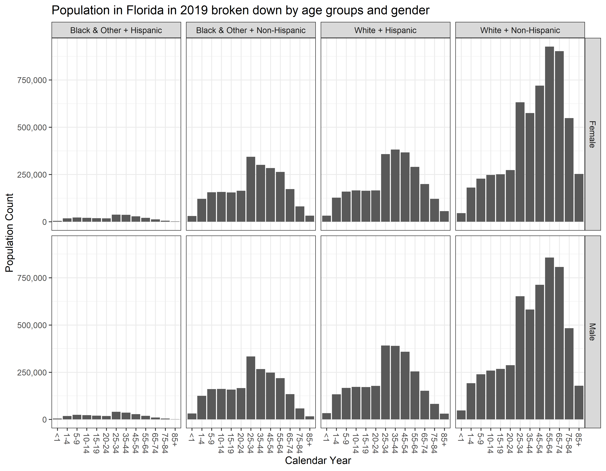

<!-- These two chunks should be added in the beginning of every .Rmd that you want to source an .R script -->
<!--  The 1st mandatory chunck  -->
<!--  Set the working directory to the repository's base directory -->


<!--  The 2nd mandatory chunck  -->
<!-- Set the report-wide options, and point to the external code file. -->


<!-- Load 'sourced' R files.  Suppress the output when loading packages. --> 


<!-- Load the sources.  Suppress the output when loading sources. --> 


<!-- Load any Global functions and variables declared in the R file.  Suppress the output. --> 


<!-- Declare any global functions specific to a Rmd output.  Suppress the output. --> 


<!-- Load the datasets.   -->


<!-- Inspect the datasets.   -->


<!-- Tweak the datasets.   -->


# Graph 1 ( 3 points)

```r
# graph of the total population of Florida by broken down by 4 ethnic groups (race_ethnicity)
# Hint 1: use `ds_totals`
# Hint 2: not all rows will be used, figure out which one you need
# Hint 3: you will need to pivot_longer
# Hint 4: https://stackoverflow.com/questions/1330989/rotating-and-spacing-axis-labels-in-ggplot2
g1 <- ds_totals %>%
  dplyr::filter(sex == "Total")  %>%
  dplyr::filter(ethnicity != "Total")  %>%
  tidyr::pivot_longer(cols = as.character(2006:2020),names_to = "year", values_to = "count") %>%
  dplyr::select(-age_group, -sex) %>%
  ggplot(aes(x = year,  y = count, color = race_ethnicity))+
  geom_line(aes(group = race_ethnicity))+
  geom_point(shape = 21, fill = NA, size =2)+
  scale_y_continuous(labels = scales::comma)+
  theme_bw()+
  theme(
    axis.text.x = element_text(angle = - 90,vjust =.5, hjust = -0)
    #https://stackoverflow.com/questions/1330989/rotating-and-spacing-axis-labels-in-ggplot2
  )+
  labs(
    title = "Population growth in Florida over last 15 years \n  broken down by ethnic groups"
    ,color = "Ethnic Group"
    ,x = "Calendar Year"
    ,y = "Population Count"
  )
g1
```



# Question 1 (1 points)

```r
# Q: what Ethnic group is most dissimilar from the other three in their dynamics?
# Hint 1: You will neet to tweak g1 a bit to see this
# Hist 2: Dynamics means HOW they change over time
# Hint 3: https://r-graphics.org/recipe-facet-free
# Answer: "White + Non-Hispanic" because of a "dip" in lat 2000's
g1 + facet_wrap(~race_ethnicity, scale = "free_y")
```



# Graph 2 (3 points)

```r
# Build a graph showing age composition of ethnic groups in 2019
# Hint 1: use `ds4`
# Hint 2: https://stackoverflow.com/questions/14563989/force-r-to-stop-plotting-abbreviated-axis-labels-e-g-1e00-in-ggplot2 and https://r-graphics.org/recipe-axes-tick-label
# Hint 3: https://r-graphics.org/recipe-axes-tick-label
g2 <- ds4 %>%
  dplyr::filter(year == 2019) %>%
  ggplot(aes(x = age_group, y = count)) +
  geom_col()+
  facet_grid(sex ~ race_ethnicity)+
  scale_y_continuous(labels = scales::comma)+
  # https://stackoverflow.com/questions/14563989/force-r-to-stop-plotting-abbreviated-axis-labels-e-g-1e00-in-ggplot2 also https://r-graphics.org/recipe-axes-tick-label
  theme_bw()+
  theme(
     axis.text.x = element_text(angle = - 90,vjust =.5, hjust = -0)
     #https://stackoverflow.com/questions/1330989/rotating-and-spacing-axis-labels-in-ggplot2
  )+
  labs(
    title = "Population in Florida in 2019 broken down by age groups and gender"
    ,color = "Ethnic Group"
    ,x = "Calendar Year"
    ,y = "Population Count"
  )
g2
```



# Question 2 (1 point)

```r
# Q2 Why is there a sudden jump in numbers  after age 24 in every ethnic group?
# Answer: because the age category includes twice as many values (e.g. 20-24 vs 25-34)
```

session information
===========================================================================

For the sake of documentation and reproducibility, the current report was rendered in the following environment.  Click the line below to expand.

<details>
  <summary>Environment <span class="glyphicon glyphicon-plus-sign"></span></summary>

```
- Session info -------------------------------------------------------------------------------------------------------
 setting  value                       
 version  R version 3.6.2 (2019-12-12)
 os       Windows 10 x64              
 system   x86_64, mingw32             
 ui       RStudio                     
 language (EN)                        
 collate  English_United States.1252  
 ctype    English_United States.1252  
 tz       America/New_York            
 date     2020-03-10                  

- Packages -----------------------------------------------------------------------------------------------------------
 package     * version date       lib source        
 assertthat    0.2.1   2019-03-21 [1] CRAN (R 3.6.2)
 backports     1.1.5   2019-10-02 [1] CRAN (R 3.6.1)
 callr         3.4.2   2020-02-12 [1] CRAN (R 3.6.2)
 cellranger    1.1.0   2016-07-27 [1] CRAN (R 3.6.2)
 cli           2.0.1   2020-01-08 [1] CRAN (R 3.6.2)
 codetools     0.2-16  2018-12-24 [2] CRAN (R 3.6.2)
 colorspace    1.4-1   2019-03-18 [1] CRAN (R 3.6.1)
 crayon        1.3.4   2017-09-16 [1] CRAN (R 3.6.2)
 desc          1.2.0   2018-05-01 [1] CRAN (R 3.6.2)
 devtools      2.2.2   2020-02-17 [1] CRAN (R 3.6.3)
 digest        0.6.24  2020-02-12 [1] CRAN (R 3.6.2)
 dplyr       * 0.8.4   2020-01-31 [1] CRAN (R 3.6.2)
 ellipsis      0.3.0   2019-09-20 [1] CRAN (R 3.6.2)
 evaluate      0.14    2019-05-28 [1] CRAN (R 3.6.2)
 fansi         0.4.1   2020-01-08 [1] CRAN (R 3.6.2)
 farver        2.0.3   2020-01-16 [1] CRAN (R 3.6.2)
 fs            1.3.1   2019-05-06 [1] CRAN (R 3.6.2)
 ggplot2     * 3.2.1   2019-08-10 [1] CRAN (R 3.6.2)
 ggpubr      * 0.2.5   2020-02-13 [1] CRAN (R 3.6.2)
 ggsignif      0.6.0   2019-08-08 [1] CRAN (R 3.6.2)
 glue          1.3.1   2019-03-12 [1] CRAN (R 3.6.2)
 gtable        0.3.0   2019-03-25 [1] CRAN (R 3.6.2)
 hms           0.5.3   2020-01-08 [1] CRAN (R 3.6.2)
 htmltools     0.4.0   2019-10-04 [1] CRAN (R 3.6.2)
 knitr       * 1.28    2020-02-06 [1] CRAN (R 3.6.2)
 labeling      0.3     2014-08-23 [1] CRAN (R 3.6.0)
 lazyeval      0.2.2   2019-03-15 [1] CRAN (R 3.6.2)
 lifecycle     0.1.0   2019-08-01 [1] CRAN (R 3.6.2)
 magrittr    * 1.5     2014-11-22 [1] CRAN (R 3.6.2)
 memoise       1.1.0   2017-04-21 [1] CRAN (R 3.6.2)
 munsell       0.5.0   2018-06-12 [1] CRAN (R 3.6.2)
 pillar        1.4.3   2019-12-20 [1] CRAN (R 3.6.2)
 pkgbuild      1.0.6   2019-10-09 [1] CRAN (R 3.6.2)
 pkgconfig     2.0.3   2019-09-22 [1] CRAN (R 3.6.2)
 pkgload       1.0.2   2018-10-29 [1] CRAN (R 3.6.2)
 plyr          1.8.5   2019-12-10 [1] CRAN (R 3.6.2)
 prettyunits   1.1.1   2020-01-24 [1] CRAN (R 3.6.2)
 processx      3.4.2   2020-02-09 [1] CRAN (R 3.6.2)
 pryr          0.1.4   2018-02-18 [1] CRAN (R 3.6.2)
 ps            1.3.2   2020-02-13 [1] CRAN (R 3.6.2)
 purrr         0.3.3   2019-10-18 [1] CRAN (R 3.6.2)
 R6            2.4.1   2019-11-12 [1] CRAN (R 3.6.2)
 Rcpp          1.0.3   2019-11-08 [1] CRAN (R 3.6.2)
 readr         1.3.1   2018-12-21 [1] CRAN (R 3.6.2)
 readxl      * 1.3.1   2019-03-13 [1] CRAN (R 3.6.2)
 remotes       2.1.1   2020-02-15 [1] CRAN (R 3.6.2)
 reshape2      1.4.3   2017-12-11 [1] CRAN (R 3.6.2)
 rlang         0.4.4   2020-01-28 [1] CRAN (R 3.6.2)
 rmarkdown     2.1     2020-01-20 [1] CRAN (R 3.6.2)
 rprojroot     1.3-2   2018-01-03 [1] CRAN (R 3.6.2)
 rstudioapi    0.11    2020-02-07 [1] CRAN (R 3.6.2)
 scales        1.1.0   2019-11-18 [1] CRAN (R 3.6.2)
 sessioninfo   1.1.1   2018-11-05 [1] CRAN (R 3.6.2)
 stringi       1.4.5   2020-01-11 [1] CRAN (R 3.6.2)
 stringr       1.4.0   2019-02-10 [1] CRAN (R 3.6.2)
 testthat      2.3.1   2019-12-01 [1] CRAN (R 3.6.2)
 tibble        2.1.3   2019-06-06 [1] CRAN (R 3.6.2)
 tidyr         1.0.2   2020-01-24 [1] CRAN (R 3.6.2)
 tidyselect    1.0.0   2020-01-27 [1] CRAN (R 3.6.2)
 usethis       1.5.1   2019-07-04 [1] CRAN (R 3.6.2)
 utf8          1.1.4   2018-05-24 [1] CRAN (R 3.6.2)
 vctrs         0.2.2   2020-01-24 [1] CRAN (R 3.6.2)
 withr         2.1.2   2018-03-15 [1] CRAN (R 3.6.2)
 xfun          0.12    2020-01-13 [1] CRAN (R 3.6.2)
 yaml          2.2.1   2020-02-01 [1] CRAN (R 3.6.2)

[1] C:/Users/an499583/Documents/R/win-library/3.6
[2] C:/Program Files/R/R-3.6.2/library
```
