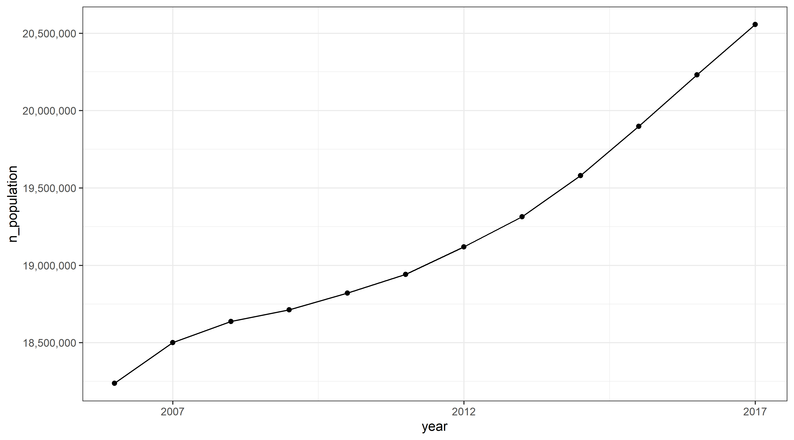
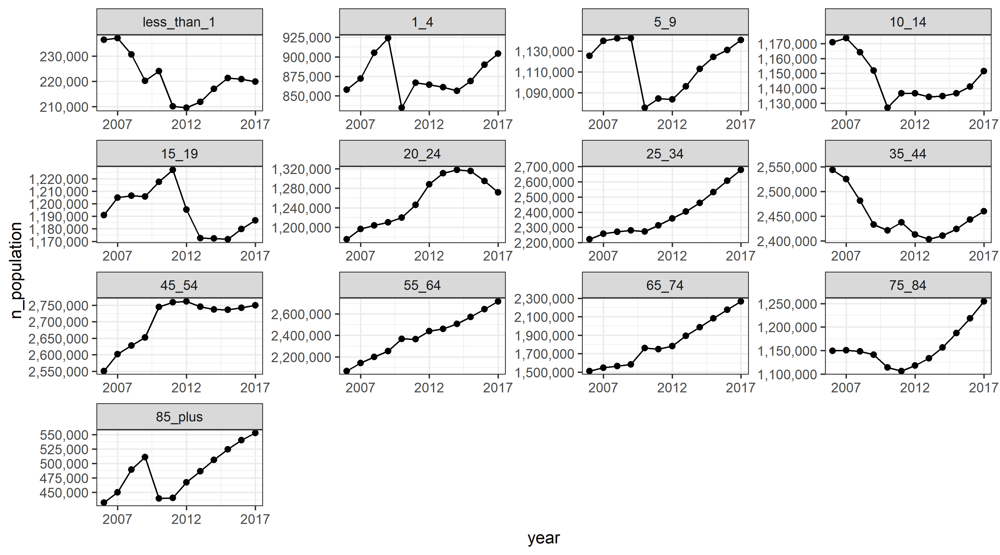
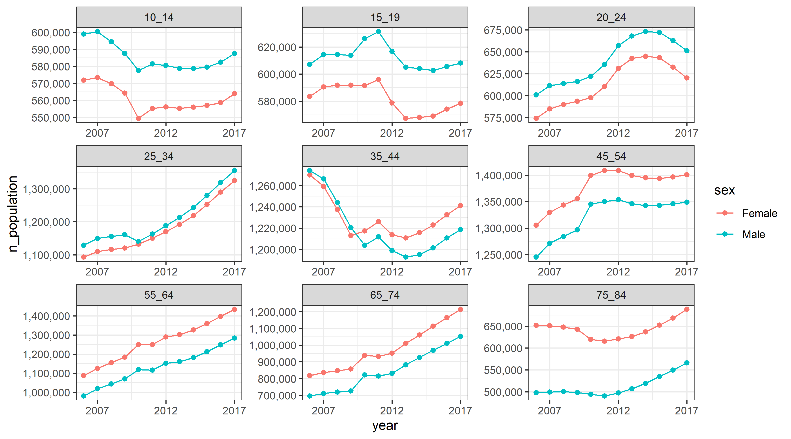
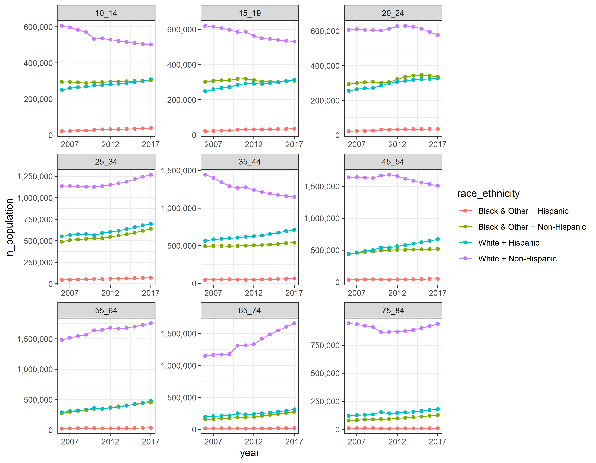
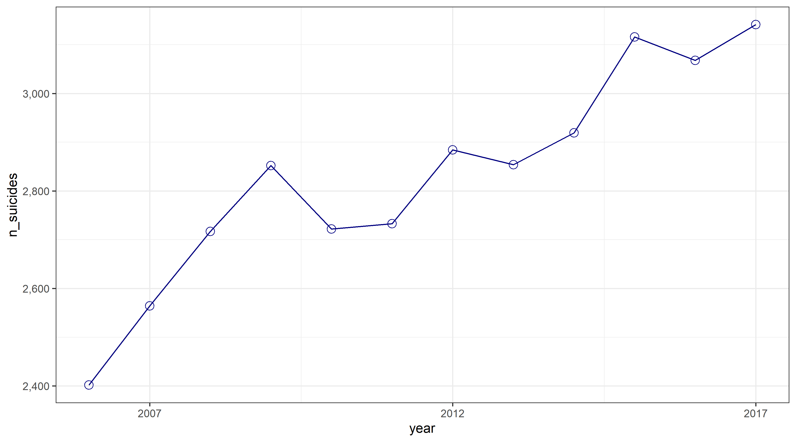
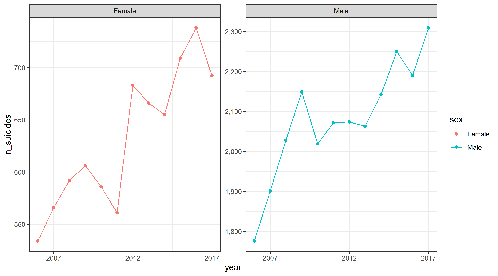
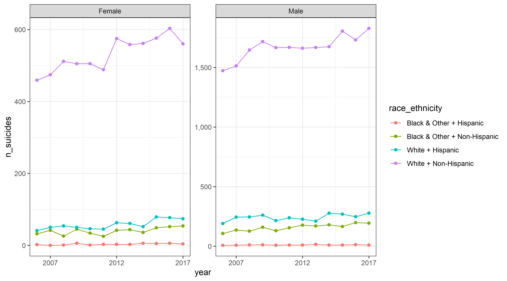
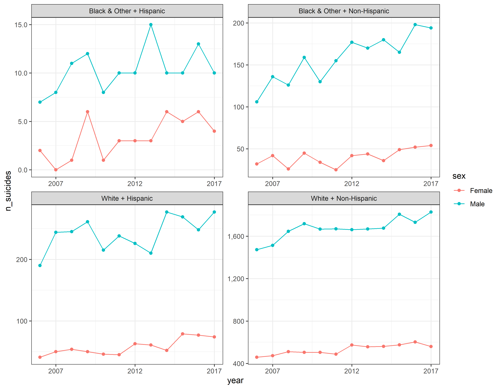
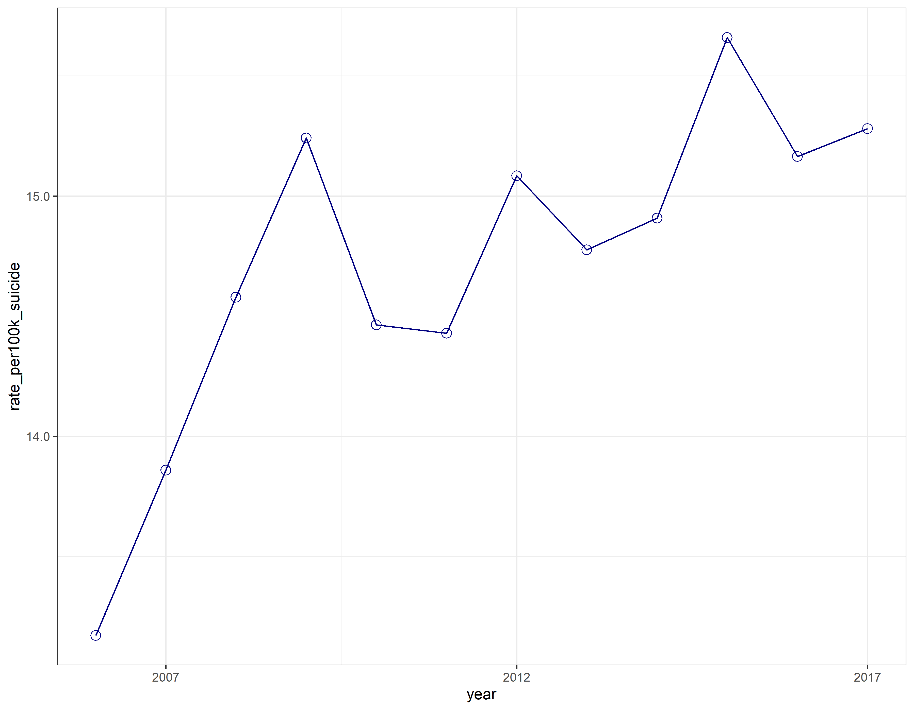
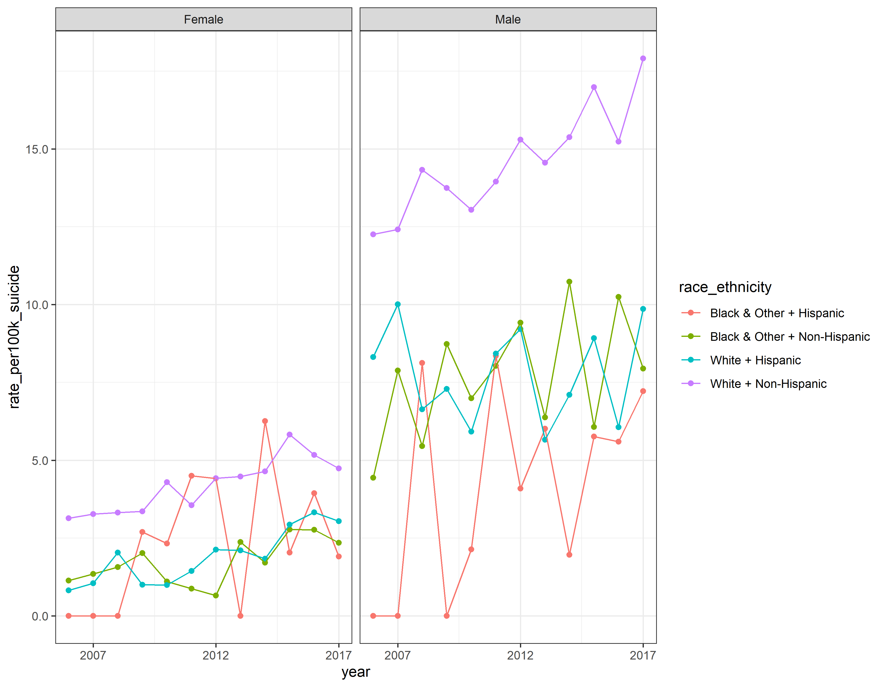

<!-- These two chunks should be added in the beginning of every .Rmd that you want to source an .R script -->
<!--  The 1st mandatory chunck  -->
<!--  Set the working directory to the repository's base directory -->


<!--  The 2nd mandatory chunck  -->
<!-- Set the report-wide options, and point to the external code file. -->


# Environment
<!-- Load packages to be used in the report  --> 

```{.r .numberLines}
# Attach these packages so their functions don't need to be qualified
# see http://r-pkgs.had.co.nz/namespace.html#search-path
library(magrittr) # pipes %>%
library(ggplot2)  # graphs
library(dplyr)    # data wrangling
requireNamespace("tidyr")  # data tidying
```

<!-- Load 'sourced' R files.  Suppress the output when loading packages. --> 

```{.r .numberLines}
# source("./scripts/modeling/model-basic.R")
source("./scripts/common-functions.R")
```

<!-- Load any Global functions and variables declared in the R file.  Suppress the output. -->
 
# Data


```{.r .numberLines}
# data from Florida Health Charts
ds_population_suicide <-   readr::read_csv(path_file_input)
```

# Tweaking


```{.r .numberLines}
ds0 <- ds_population_suicide %>%
  dplyr::mutate(
    year            = as.integer(year)
    ,sex            = factor(sex)
    ,race_ethnicity = factor(paste0(race, " + ", ethnicity))
    ,race           = factor(race)
    ,ethnicity      = factor(ethnicity)
    ,age_group      = factor(age_group, levels = lvl_age_groups)
    ,n_population   = as.integer(n_population)
    ,n_suicides     = as.integer(n_suicides)
  )
ds0 %>% dplyr::glimpse(70)
```

```
Observations: 83,616
Variables: 16
$ county                                <chr> "Alachua", "Alachua...
$ year                                  <int> 2006, 2006, 2006, 2...
$ sex                                   <fct> Female, Female, Fem...
$ race                                  <fct> Black & Other, Blac...
$ ethnicity                             <fct> Hispanic, Hispanic,...
$ age_group                             <fct> 1_4, 10_14, 15_19, ...
$ n_population                          <int> 36, 50, 125, 250, 1...
$ n_suicides                            <int> NA, NA, NA, NA, NA,...
$ `Drugs & Biological Substances`       <dbl> NA, NA, NA, NA, NA,...
$ `Other Gases & Vapors`                <dbl> NA, NA, NA, NA, NA,...
$ `Hanging, Strangulation, Suffocation` <dbl> NA, NA, NA, NA, NA,...
$ `Firearms Discharge`                  <dbl> NA, NA, NA, NA, NA,...
$ `Jump From High Place`                <dbl> NA, NA, NA, NA, NA,...
$ `Other & Unspec & Sequelae`           <dbl> NA, NA, NA, NA, NA,...
$ `Other & Unspec Sol/Liq & Vapor`      <dbl> NA, NA, NA, NA, NA,...
$ race_ethnicity                        <fct> Black & Other + His...
```

# Population trends 

## 1. Total count 
> How does the total population of Florida changes between 2006 and 2020?



## 2. Within age groups
> What was the trajectory of population growth for each age group?



## 3. Sex and age groups
> For residends between 10 and 84 years of age, what was the trajectory of growth for each age group by sex? 



## 4. Ethnic group
> For residends between 10 and 84 years of age, what was the trajectory of growth for each ethnic group?




# Suicide counts 

## 1. Total count 
> What is the trajectory of total suicides in FL between 2006 and 2017?



## 2. Men vs Women
> How does the trend of total suicides differ between men and women?



## 3. Sex and age groups
>For residends between 10 and 84 years of age, how does the trend of suicides counts among ethnic groups differ by sex?  



## 4. Ethnic group

> For residends between 10 and 84 years of age, how does the trend of total suicides between men and women differ across ethnic groups?  




# Suicide rates

## 1. Function `compute_rates`


Compose the function that computes a rate of suicides per `100,000` for a given aggregation frame. To help you get started, here's the general shape of this function

```{.r .numberLines}
compute_suicide_rate <- function(d_input, group_by_variables){
  d_output <- d_input %>%

  return(d_output)
}
```
Add necessary line, so that the function behaves in the following way and generates the following output:   

```{.r .numberLines}
d <- ds0 %>% compute_suicide_rate(group_by_variables = c("year","sex")) # `group_by_variables` may be different
d %>% neat()
```

<table class="table table-striped table-hover table-condensed table-responsive" style="width: auto !important; ">
 <thead>
  <tr>
   <th style="text-align:right;"> year </th>
   <th style="text-align:left;"> sex </th>
   <th style="text-align:right;"> n_population </th>
   <th style="text-align:right;"> n_suicides </th>
   <th style="text-align:right;"> rate_per100k_suicide </th>
  </tr>
 </thead>
<tbody>
  <tr>
   <td style="text-align:right;"> 2006 </td>
   <td style="text-align:left;"> Female </td>
   <td style="text-align:right;"> 9318355 </td>
   <td style="text-align:right;"> 548 </td>
   <td style="text-align:right;"> 5.880866 </td>
  </tr>
  <tr>
   <td style="text-align:right;"> 2006 </td>
   <td style="text-align:left;"> Male </td>
   <td style="text-align:right;"> 8919241 </td>
   <td style="text-align:right;"> 1854 </td>
   <td style="text-align:right;"> 20.786522 </td>
  </tr>
  <tr>
   <td style="text-align:right;"> 2007 </td>
   <td style="text-align:left;"> Female </td>
   <td style="text-align:right;"> 9448530 </td>
   <td style="text-align:right;"> 581 </td>
   <td style="text-align:right;"> 6.149105 </td>
  </tr>
  <tr>
   <td style="text-align:right;"> 2007 </td>
   <td style="text-align:left;"> Male </td>
   <td style="text-align:right;"> 9052428 </td>
   <td style="text-align:right;"> 1983 </td>
   <td style="text-align:right;"> 21.905725 </td>
  </tr>
  <tr>
   <td style="text-align:right;"> 2008 </td>
   <td style="text-align:left;"> Female </td>
   <td style="text-align:right;"> 9524002 </td>
   <td style="text-align:right;"> 608 </td>
   <td style="text-align:right;"> 6.383871 </td>
  </tr>
  <tr>
   <td style="text-align:right;"> 2008 </td>
   <td style="text-align:left;"> Male </td>
   <td style="text-align:right;"> 9112835 </td>
   <td style="text-align:right;"> 2109 </td>
   <td style="text-align:right;"> 23.143182 </td>
  </tr>
  <tr>
   <td style="text-align:right;"> 2009 </td>
   <td style="text-align:left;"> Female </td>
   <td style="text-align:right;"> 9565197 </td>
   <td style="text-align:right;"> 618 </td>
   <td style="text-align:right;"> 6.460923 </td>
  </tr>
  <tr>
   <td style="text-align:right;"> 2009 </td>
   <td style="text-align:left;"> Male </td>
   <td style="text-align:right;"> 9146647 </td>
   <td style="text-align:right;"> 2234 </td>
   <td style="text-align:right;"> 24.424251 </td>
  </tr>
  <tr>
   <td style="text-align:right;"> 2010 </td>
   <td style="text-align:left;"> Female </td>
   <td style="text-align:right;"> 9618052 </td>
   <td style="text-align:right;"> 605 </td>
   <td style="text-align:right;"> 6.290255 </td>
  </tr>
  <tr>
   <td style="text-align:right;"> 2010 </td>
   <td style="text-align:left;"> Male </td>
   <td style="text-align:right;"> 9202228 </td>
   <td style="text-align:right;"> 2117 </td>
   <td style="text-align:right;"> 23.005298 </td>
  </tr>
  <tr>
   <td style="text-align:right;"> 2011 </td>
   <td style="text-align:left;"> Female </td>
   <td style="text-align:right;"> 9682585 </td>
   <td style="text-align:right;"> 577 </td>
   <td style="text-align:right;"> 5.959152 </td>
  </tr>
  <tr>
   <td style="text-align:right;"> 2011 </td>
   <td style="text-align:left;"> Male </td>
   <td style="text-align:right;"> 9259157 </td>
   <td style="text-align:right;"> 2156 </td>
   <td style="text-align:right;"> 23.285057 </td>
  </tr>
  <tr>
   <td style="text-align:right;"> 2012 </td>
   <td style="text-align:left;"> Female </td>
   <td style="text-align:right;"> 9771987 </td>
   <td style="text-align:right;"> 702 </td>
   <td style="text-align:right;"> 7.183800 </td>
  </tr>
  <tr>
   <td style="text-align:right;"> 2012 </td>
   <td style="text-align:left;"> Male </td>
   <td style="text-align:right;"> 9346951 </td>
   <td style="text-align:right;"> 2182 </td>
   <td style="text-align:right;"> 23.344511 </td>
  </tr>
  <tr>
   <td style="text-align:right;"> 2013 </td>
   <td style="text-align:left;"> Female </td>
   <td style="text-align:right;"> 9873569 </td>
   <td style="text-align:right;"> 682 </td>
   <td style="text-align:right;"> 6.907330 </td>
  </tr>
  <tr>
   <td style="text-align:right;"> 2013 </td>
   <td style="text-align:left;"> Male </td>
   <td style="text-align:right;"> 9440827 </td>
   <td style="text-align:right;"> 2172 </td>
   <td style="text-align:right;"> 23.006459 </td>
  </tr>
  <tr>
   <td style="text-align:right;"> 2014 </td>
   <td style="text-align:left;"> Female </td>
   <td style="text-align:right;"> 10008036 </td>
   <td style="text-align:right;"> 672 </td>
   <td style="text-align:right;"> 6.714604 </td>
  </tr>
  <tr>
   <td style="text-align:right;"> 2014 </td>
   <td style="text-align:left;"> Male </td>
   <td style="text-align:right;"> 9571835 </td>
   <td style="text-align:right;"> 2247 </td>
   <td style="text-align:right;"> 23.475123 </td>
  </tr>
  <tr>
   <td style="text-align:right;"> 2015 </td>
   <td style="text-align:left;"> Female </td>
   <td style="text-align:right;"> 10172238 </td>
   <td style="text-align:right;"> 733 </td>
   <td style="text-align:right;"> 7.205887 </td>
  </tr>
  <tr>
   <td style="text-align:right;"> 2015 </td>
   <td style="text-align:left;"> Male </td>
   <td style="text-align:right;"> 9725524 </td>
   <td style="text-align:right;"> 2383 </td>
   <td style="text-align:right;"> 24.502536 </td>
  </tr>
  <tr>
   <td style="text-align:right;"> 2016 </td>
   <td style="text-align:left;"> Female </td>
   <td style="text-align:right;"> 10343928 </td>
   <td style="text-align:right;"> 758 </td>
   <td style="text-align:right;"> 7.327971 </td>
  </tr>
  <tr>
   <td style="text-align:right;"> 2016 </td>
   <td style="text-align:left;"> Male </td>
   <td style="text-align:right;"> 9887164 </td>
   <td style="text-align:right;"> 2310 </td>
   <td style="text-align:right;"> 23.363626 </td>
  </tr>
  <tr>
   <td style="text-align:right;"> 2017 </td>
   <td style="text-align:left;"> Female </td>
   <td style="text-align:right;"> 10512809 </td>
   <td style="text-align:right;"> 707 </td>
   <td style="text-align:right;"> 6.725129 </td>
  </tr>
  <tr>
   <td style="text-align:right;"> 2017 </td>
   <td style="text-align:left;"> Male </td>
   <td style="text-align:right;"> 10042919 </td>
   <td style="text-align:right;"> 2434 </td>
   <td style="text-align:right;"> 24.235982 </td>
  </tr>
</tbody>
</table>

> Hint 1  

You will need to use `group_by` with `.dots` argument

> Hint 2

Make sure you `ungroup` before computing the rates in a separate `mutate` statement

## 2. Total rates
>  What is the trend of the total suicide rates in Florida between 2006 and 2017?  



## 3. Youth by race and gender
> For residends between 10 and 24 years of age, how does the rate of suicide vary by race and gender?  




# Further insights

What other interesting patterns did you discern in this data? 


session information
===========================================================================

For the sake of documentation and reproducibility, the current report was rendered in the following environment.  Click the line below to expand.

<details>
  <summary>Environment <span class="glyphicon glyphicon-plus-sign"></span></summary>

```
- Session info -------------------------------------------------------------------------------------------------------
 setting  value                       
 version  R version 3.6.2 (2019-12-12)
 os       Windows 10 x64              
 system   x86_64, mingw32             
 ui       RTerm                       
 language (EN)                        
 collate  English_United States.1252  
 ctype    English_United States.1252  
 tz       America/New_York            
 date     2020-04-13                  

- Packages -----------------------------------------------------------------------------------------------------------
 package     * version date       lib source        
 assertthat    0.2.1   2019-03-21 [1] CRAN (R 3.6.2)
 backports     1.1.5   2019-10-02 [1] CRAN (R 3.6.1)
 callr         3.4.2   2020-02-12 [1] CRAN (R 3.6.2)
 cli           2.0.1   2020-01-08 [1] CRAN (R 3.6.2)
 colorspace    1.4-1   2019-03-18 [1] CRAN (R 3.6.1)
 crayon        1.3.4   2017-09-16 [1] CRAN (R 3.6.2)
 desc          1.2.0   2018-05-01 [1] CRAN (R 3.6.2)
 devtools      2.2.2   2020-02-17 [1] CRAN (R 3.6.3)
 digest        0.6.24  2020-02-12 [1] CRAN (R 3.6.2)
 dplyr       * 0.8.4   2020-01-31 [1] CRAN (R 3.6.2)
 ellipsis      0.3.0   2019-09-20 [1] CRAN (R 3.6.2)
 evaluate      0.14    2019-05-28 [1] CRAN (R 3.6.2)
 fansi         0.4.1   2020-01-08 [1] CRAN (R 3.6.2)
 fs            1.3.1   2019-05-06 [1] CRAN (R 3.6.2)
 ggplot2     * 3.2.1   2019-08-10 [1] CRAN (R 3.6.2)
 glue          1.3.1   2019-03-12 [1] CRAN (R 3.6.2)
 gtable        0.3.0   2019-03-25 [1] CRAN (R 3.6.2)
 highr         0.8     2019-03-20 [1] CRAN (R 3.6.2)
 hms           0.5.3   2020-01-08 [1] CRAN (R 3.6.2)
 htmltools     0.4.0   2019-10-04 [1] CRAN (R 3.6.2)
 httr          1.4.1   2019-08-05 [1] CRAN (R 3.6.2)
 kableExtra    1.1.0   2019-03-16 [1] CRAN (R 3.6.3)
 knitr       * 1.28    2020-02-06 [1] CRAN (R 3.6.2)
 lazyeval      0.2.2   2019-03-15 [1] CRAN (R 3.6.2)
 lifecycle     0.1.0   2019-08-01 [1] CRAN (R 3.6.2)
 magrittr    * 1.5     2014-11-22 [1] CRAN (R 3.6.2)
 memoise       1.1.0   2017-04-21 [1] CRAN (R 3.6.2)
 munsell       0.5.0   2018-06-12 [1] CRAN (R 3.6.2)
 pillar        1.4.3   2019-12-20 [1] CRAN (R 3.6.2)
 pkgbuild      1.0.6   2019-10-09 [1] CRAN (R 3.6.2)
 pkgconfig     2.0.3   2019-09-22 [1] CRAN (R 3.6.2)
 pkgload       1.0.2   2018-10-29 [1] CRAN (R 3.6.2)
 prettyunits   1.1.1   2020-01-24 [1] CRAN (R 3.6.2)
 processx      3.4.2   2020-02-09 [1] CRAN (R 3.6.2)
 ps            1.3.2   2020-02-13 [1] CRAN (R 3.6.2)
 purrr         0.3.3   2019-10-18 [1] CRAN (R 3.6.2)
 R6            2.4.1   2019-11-12 [1] CRAN (R 3.6.2)
 Rcpp          1.0.3   2019-11-08 [1] CRAN (R 3.6.2)
 readr         1.3.1   2018-12-21 [1] CRAN (R 3.6.2)
 remotes       2.1.1   2020-02-15 [1] CRAN (R 3.6.2)
 rlang         0.4.4   2020-01-28 [1] CRAN (R 3.6.2)
 rmarkdown     2.1     2020-01-20 [1] CRAN (R 3.6.2)
 rprojroot     1.3-2   2018-01-03 [1] CRAN (R 3.6.2)
 rstudioapi    0.11    2020-02-07 [1] CRAN (R 3.6.2)
 rvest         0.3.5   2019-11-08 [1] CRAN (R 3.6.2)
 scales        1.1.0   2019-11-18 [1] CRAN (R 3.6.2)
 sessioninfo   1.1.1   2018-11-05 [1] CRAN (R 3.6.2)
 stringi       1.4.5   2020-01-11 [1] CRAN (R 3.6.2)
 stringr       1.4.0   2019-02-10 [1] CRAN (R 3.6.2)
 testthat      2.3.1   2019-12-01 [1] CRAN (R 3.6.2)
 tibble        2.1.3   2019-06-06 [1] CRAN (R 3.6.2)
 tidyr         1.0.2   2020-01-24 [1] CRAN (R 3.6.2)
 tidyselect    1.0.0   2020-01-27 [1] CRAN (R 3.6.2)
 usethis       1.5.1   2019-07-04 [1] CRAN (R 3.6.2)
 utf8          1.1.4   2018-05-24 [1] CRAN (R 3.6.2)
 vctrs         0.2.2   2020-01-24 [1] CRAN (R 3.6.2)
 viridisLite   0.3.0   2018-02-01 [1] CRAN (R 3.6.2)
 webshot       0.5.2   2019-11-22 [1] CRAN (R 3.6.3)
 withr         2.1.2   2018-03-15 [1] CRAN (R 3.6.2)
 xfun          0.12    2020-01-13 [1] CRAN (R 3.6.2)
 xml2          1.2.2   2019-08-09 [1] CRAN (R 3.6.2)
 yaml          2.2.1   2020-02-01 [1] CRAN (R 3.6.2)

[1] C:/Users/an499583/Documents/R/win-library/3.6
[2] C:/Program Files/R/R-3.6.2/library
```
