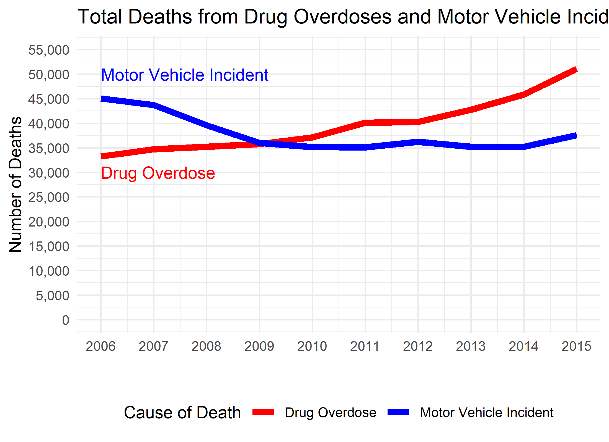

<!-- These two chunks should be added in the beginning of every .Rmd that you want to source an .R script -->
<!--  The 1st mandatory chunck  -->
<!--  Set the working directory to the repository's base directory -->


<!--  The 2nd mandatory chunck  -->
<!-- Set the report-wide options, and point to the external code file. -->


<!-- Load packages to be used in this report. --> 

```r
# Attach these packages so their functions don't need to be qualified: http://r-pkgs.had.co.nz/namespace.html#search-path
library(magrittr) # enables piping : %>%
library(dplyr)    # data wrangling
library(ggplot2)  # graphs
library(tidyr)    # data tidying
```


<!-- Load the sources.  Suppress the output when loading sources. --> 

```r
# Call `base::source()` on any repo file that defines functions needed below.
source("./scripts/common-functions.R") # used in multiple reports
source("./scripts/graphing/graph-presets.R") # fonts, colors, themes
```


<!-- Load any Global functions and variables declared in the R file.  Suppress the output. --> 


<!-- Declare any global functions specific to a Rmd output.  Suppress the output. --> 

```r
#Put code in here.  It doesn't call a chunk in the codebehind file.
```
# Load Data
<!-- Load the datasets.   -->

```r
path_file <- "./data-public/raw/Tableau_10_Training_Files/Tableau 10 Training Practice Data.xlsx"
sheet_names <- readxl::excel_sheets(path_file)
dto <- list()
for(sheet_i in sheet_names){
  # i <- sheet_names[1]
  dto[[sheet_i]] <- readxl::read_xlsx(path_file, sheet = sheet_i)
}
ds_drug_overdose_deaths <- dto$`17 - Drug Overdose Deaths`
ds_motor_vehicle_deaths <- dto$`18 - Motor Vehicle Deaths`
```

<!-- Inspect the datasets.   -->

```r
ds_drug_overdose_deaths %>% glimpse(55)
```

```
Observations: 7,840
Variables: 7
$ State                            <chr> "Alabama"...
$ `Underlying Cause of Death`      <chr> "Accident...
$ `Underlying Cause of Death Code` <chr> "X40", "X...
$ `Drug Overdose Deaths`           <chr> "Suppress...
$ `Census Region`                  <chr> "South", ...
$ `Census Division`                <chr> "East Sou...
$ `Report Date`                    <dttm> 2006-12-...
```

```r
ds_motor_vehicle_deaths %>% glimpse(55)
```

```
Observations: 490
Variables: 5
$ `State Name`                    <chr> "Alabama",...
$ `Census Region`                 <chr> "South", "...
$ `Motor Vehicle Incident Deaths` <dbl> 1224, 1212...
$ Date                            <dttm> 2006-12-2...
$ Population                      <dbl> 4628981, 4...
```

# Tweak Data
<!-- Tweak the datasets.   -->

```r
names(ds_drug_overdose_deaths) <- c(
  "state"
  ,"cause_of_death"
  ,"cause_code"
  ,"n_death_overdose"
  ,"region"
  ,"division"
  ,"date"
)
names(ds_motor_vehicle_deaths) <- c(
  "state"
  ,"region"
  ,"n_death_car"
  ,"date"
  ,"population"
)
ds_drug <- ds_drug_overdose_deaths %>%
  dplyr::mutate(
    year = lubridate::year(date)
    ,n_death_overdose = ifelse(n_death_overdose=="Suppressed",NA, n_death_overdose) %>% as.integer()
  ) %>%
  dplyr::group_by(year) %>%
  dplyr::summarize(
    n_death_overdose = sum(n_death_overdose, na.rm = T)
  ) %>%
  dplyr::ungroup()
ds_drug %>% neat()
```

<table class="table table-striped table-hover table-condensed table-responsive" style="width: auto !important; ">
 <thead>
  <tr>
   <th style="text-align:right;"> year </th>
   <th style="text-align:right;"> n_death_overdose </th>
  </tr>
 </thead>
<tbody>
  <tr>
   <td style="text-align:right;"> 2006 </td>
   <td style="text-align:right;"> 33240 </td>
  </tr>
  <tr>
   <td style="text-align:right;"> 2007 </td>
   <td style="text-align:right;"> 34727 </td>
  </tr>
  <tr>
   <td style="text-align:right;"> 2008 </td>
   <td style="text-align:right;"> 35224 </td>
  </tr>
  <tr>
   <td style="text-align:right;"> 2009 </td>
   <td style="text-align:right;"> 35779 </td>
  </tr>
  <tr>
   <td style="text-align:right;"> 2010 </td>
   <td style="text-align:right;"> 37123 </td>
  </tr>
  <tr>
   <td style="text-align:right;"> 2011 </td>
   <td style="text-align:right;"> 40122 </td>
  </tr>
  <tr>
   <td style="text-align:right;"> 2012 </td>
   <td style="text-align:right;"> 40267 </td>
  </tr>
  <tr>
   <td style="text-align:right;"> 2013 </td>
   <td style="text-align:right;"> 42729 </td>
  </tr>
  <tr>
   <td style="text-align:right;"> 2014 </td>
   <td style="text-align:right;"> 45825 </td>
  </tr>
  <tr>
   <td style="text-align:right;"> 2015 </td>
   <td style="text-align:right;"> 51102 </td>
  </tr>
</tbody>
</table>

```r
ds_cars <- ds_motor_vehicle_deaths %>%
  dplyr::mutate(
    year = lubridate::year(date)
  ) %>%
  dplyr::group_by(year) %>%
  dplyr::summarize(
    n_death_car = sum(n_death_car, na.rm = T)
  )%>%
  dplyr::ungroup()

ds_cars %>% neat()
```

<table class="table table-striped table-hover table-condensed table-responsive" style="width: auto !important; ">
 <thead>
  <tr>
   <th style="text-align:right;"> year </th>
   <th style="text-align:right;"> n_death_car </th>
  </tr>
 </thead>
<tbody>
  <tr>
   <td style="text-align:right;"> 2006 </td>
   <td style="text-align:right;"> 45074 </td>
  </tr>
  <tr>
   <td style="text-align:right;"> 2007 </td>
   <td style="text-align:right;"> 43702 </td>
  </tr>
  <tr>
   <td style="text-align:right;"> 2008 </td>
   <td style="text-align:right;"> 39609 </td>
  </tr>
  <tr>
   <td style="text-align:right;"> 2009 </td>
   <td style="text-align:right;"> 36011 </td>
  </tr>
  <tr>
   <td style="text-align:right;"> 2010 </td>
   <td style="text-align:right;"> 35137 </td>
  </tr>
  <tr>
   <td style="text-align:right;"> 2011 </td>
   <td style="text-align:right;"> 35108 </td>
  </tr>
  <tr>
   <td style="text-align:right;"> 2012 </td>
   <td style="text-align:right;"> 36207 </td>
  </tr>
  <tr>
   <td style="text-align:right;"> 2013 </td>
   <td style="text-align:right;"> 35191 </td>
  </tr>
  <tr>
   <td style="text-align:right;"> 2014 </td>
   <td style="text-align:right;"> 35203 </td>
  </tr>
  <tr>
   <td style="text-align:right;"> 2015 </td>
   <td style="text-align:right;"> 37578 </td>
  </tr>
</tbody>
</table>

```r
ds_joined <- dplyr::left_join(
  ds_drug
  ,ds_cars
  ,by = "year"
)
ds_joined %>% neat()
```

<table class="table table-striped table-hover table-condensed table-responsive" style="width: auto !important; ">
 <thead>
  <tr>
   <th style="text-align:right;"> year </th>
   <th style="text-align:right;"> n_death_overdose </th>
   <th style="text-align:right;"> n_death_car </th>
  </tr>
 </thead>
<tbody>
  <tr>
   <td style="text-align:right;"> 2006 </td>
   <td style="text-align:right;"> 33240 </td>
   <td style="text-align:right;"> 45074 </td>
  </tr>
  <tr>
   <td style="text-align:right;"> 2007 </td>
   <td style="text-align:right;"> 34727 </td>
   <td style="text-align:right;"> 43702 </td>
  </tr>
  <tr>
   <td style="text-align:right;"> 2008 </td>
   <td style="text-align:right;"> 35224 </td>
   <td style="text-align:right;"> 39609 </td>
  </tr>
  <tr>
   <td style="text-align:right;"> 2009 </td>
   <td style="text-align:right;"> 35779 </td>
   <td style="text-align:right;"> 36011 </td>
  </tr>
  <tr>
   <td style="text-align:right;"> 2010 </td>
   <td style="text-align:right;"> 37123 </td>
   <td style="text-align:right;"> 35137 </td>
  </tr>
  <tr>
   <td style="text-align:right;"> 2011 </td>
   <td style="text-align:right;"> 40122 </td>
   <td style="text-align:right;"> 35108 </td>
  </tr>
  <tr>
   <td style="text-align:right;"> 2012 </td>
   <td style="text-align:right;"> 40267 </td>
   <td style="text-align:right;"> 36207 </td>
  </tr>
  <tr>
   <td style="text-align:right;"> 2013 </td>
   <td style="text-align:right;"> 42729 </td>
   <td style="text-align:right;"> 35191 </td>
  </tr>
  <tr>
   <td style="text-align:right;"> 2014 </td>
   <td style="text-align:right;"> 45825 </td>
   <td style="text-align:right;"> 35203 </td>
  </tr>
  <tr>
   <td style="text-align:right;"> 2015 </td>
   <td style="text-align:right;"> 51102 </td>
   <td style="text-align:right;"> 37578 </td>
  </tr>
</tbody>
</table>


```r
g1 <- ds_joined %>%
  tidyr::pivot_longer(
    cols = c("n_death_overdose", "n_death_car")
    ,names_to = "cause_of_death"
    ,values_to = "n_deaths"
  ) %>%
  dplyr::mutate(
    cause_of_death = dplyr::recode(
      cause_of_death
      ,`n_death_overdose` = "Drug Overdose"
      ,`n_death_car`      = "Motor Vehicle Incident"
    )
  ) %>%
  ggplot(aes(x = year , y = n_deaths ))+
  # geom_point(shape = 21, fill = NA, size = 2)+
  geom_line(aes(group = cause_of_death,  color = cause_of_death), size = 2)+
  scale_y_continuous(limits = c(0, 55000), breaks = seq(0, 55000, 5000), label = scales::comma)+
  scale_x_continuous(breaks = 2006:2015)+
  theme_minimal()+
  theme(legend.position = "bottom")+
  annotate("text", x = 2006, y = 50000, label = "Motor Vehicle Incident", hjust = 0, color = "blue")+
  annotate("text", x = 2006, y = 30000, label = "Drug Overdose", color = "red", hjust = 0)+
  scale_color_manual(values = c("Drug Overdose" = "red","Motor Vehicle Incident" = "blue" )) +
  labs(
    title = "Total Deaths from Drug Overdoses and Motor Vehicle Incidents"
    ,y = "Number of Deaths"
    ,x = ""
    ,color = "Cause of Death"
  )
g1
```




<!-- Basic table view.   -->


<!-- Basic graph view.   -->


session information
===========================================================================

For the sake of documentation and reproducibility, the current report was rendered in the following environment.  Click the line below to expand.

<details>
  <summary>Environment <span class="glyphicon glyphicon-plus-sign"></span></summary>

```
- Session info -------------------------------------------------------------------------------------------------------
 setting  value                       
 version  R version 3.6.2 (2019-12-12)
 os       Windows 10 x64              
 system   x86_64, mingw32             
 ui       RTerm                       
 language (EN)                        
 collate  English_United States.1252  
 ctype    English_United States.1252  
 tz       America/New_York            
 date     2020-04-01                  

- Packages -----------------------------------------------------------------------------------------------------------
 package      * version date       lib source        
 assertthat     0.2.1   2019-03-21 [1] CRAN (R 3.6.2)
 backports      1.1.5   2019-10-02 [1] CRAN (R 3.6.1)
 callr          3.4.2   2020-02-12 [1] CRAN (R 3.6.2)
 cellranger     1.1.0   2016-07-27 [1] CRAN (R 3.6.2)
 cli            2.0.1   2020-01-08 [1] CRAN (R 3.6.2)
 colorspace     1.4-1   2019-03-18 [1] CRAN (R 3.6.1)
 crayon         1.3.4   2017-09-16 [1] CRAN (R 3.6.2)
 desc           1.2.0   2018-05-01 [1] CRAN (R 3.6.2)
 devtools       2.2.2   2020-02-17 [1] CRAN (R 3.6.3)
 dichromat    * 2.0-0   2013-01-24 [1] CRAN (R 3.6.0)
 digest         0.6.24  2020-02-12 [1] CRAN (R 3.6.2)
 dplyr        * 0.8.4   2020-01-31 [1] CRAN (R 3.6.2)
 ellipsis       0.3.0   2019-09-20 [1] CRAN (R 3.6.2)
 evaluate       0.14    2019-05-28 [1] CRAN (R 3.6.2)
 fansi          0.4.1   2020-01-08 [1] CRAN (R 3.6.2)
 farver         2.0.3   2020-01-16 [1] CRAN (R 3.6.2)
 fs             1.3.1   2019-05-06 [1] CRAN (R 3.6.2)
 ggplot2      * 3.2.1   2019-08-10 [1] CRAN (R 3.6.2)
 glue           1.3.1   2019-03-12 [1] CRAN (R 3.6.2)
 gtable         0.3.0   2019-03-25 [1] CRAN (R 3.6.2)
 highr          0.8     2019-03-20 [1] CRAN (R 3.6.2)
 hms            0.5.3   2020-01-08 [1] CRAN (R 3.6.2)
 htmltools      0.4.0   2019-10-04 [1] CRAN (R 3.6.2)
 httr           1.4.1   2019-08-05 [1] CRAN (R 3.6.2)
 kableExtra     1.1.0   2019-03-16 [1] CRAN (R 3.6.3)
 knitr        * 1.28    2020-02-06 [1] CRAN (R 3.6.2)
 lazyeval       0.2.2   2019-03-15 [1] CRAN (R 3.6.2)
 lifecycle      0.1.0   2019-08-01 [1] CRAN (R 3.6.2)
 lubridate      1.7.4   2018-04-11 [1] CRAN (R 3.6.2)
 magrittr     * 1.5     2014-11-22 [1] CRAN (R 3.6.2)
 memoise        1.1.0   2017-04-21 [1] CRAN (R 3.6.2)
 munsell        0.5.0   2018-06-12 [1] CRAN (R 3.6.2)
 pillar         1.4.3   2019-12-20 [1] CRAN (R 3.6.2)
 pkgbuild       1.0.6   2019-10-09 [1] CRAN (R 3.6.2)
 pkgconfig      2.0.3   2019-09-22 [1] CRAN (R 3.6.2)
 pkgload        1.0.2   2018-10-29 [1] CRAN (R 3.6.2)
 prettyunits    1.1.1   2020-01-24 [1] CRAN (R 3.6.2)
 processx       3.4.2   2020-02-09 [1] CRAN (R 3.6.2)
 ps             1.3.2   2020-02-13 [1] CRAN (R 3.6.2)
 purrr          0.3.3   2019-10-18 [1] CRAN (R 3.6.2)
 R6             2.4.1   2019-11-12 [1] CRAN (R 3.6.2)
 RColorBrewer * 1.1-2   2014-12-07 [1] CRAN (R 3.6.0)
 Rcpp           1.0.3   2019-11-08 [1] CRAN (R 3.6.2)
 readr          1.3.1   2018-12-21 [1] CRAN (R 3.6.2)
 readxl         1.3.1   2019-03-13 [1] CRAN (R 3.6.2)
 remotes        2.1.1   2020-02-15 [1] CRAN (R 3.6.2)
 rlang          0.4.4   2020-01-28 [1] CRAN (R 3.6.2)
 rmarkdown      2.1     2020-01-20 [1] CRAN (R 3.6.2)
 rprojroot      1.3-2   2018-01-03 [1] CRAN (R 3.6.2)
 rstudioapi     0.11    2020-02-07 [1] CRAN (R 3.6.2)
 rvest          0.3.5   2019-11-08 [1] CRAN (R 3.6.2)
 scales         1.1.0   2019-11-18 [1] CRAN (R 3.6.2)
 sessioninfo    1.1.1   2018-11-05 [1] CRAN (R 3.6.2)
 stringi        1.4.5   2020-01-11 [1] CRAN (R 3.6.2)
 stringr        1.4.0   2019-02-10 [1] CRAN (R 3.6.2)
 testthat       2.3.1   2019-12-01 [1] CRAN (R 3.6.2)
 tibble         2.1.3   2019-06-06 [1] CRAN (R 3.6.2)
 tidyr        * 1.0.2   2020-01-24 [1] CRAN (R 3.6.2)
 tidyselect     1.0.0   2020-01-27 [1] CRAN (R 3.6.2)
 usethis        1.5.1   2019-07-04 [1] CRAN (R 3.6.2)
 utf8           1.1.4   2018-05-24 [1] CRAN (R 3.6.2)
 vctrs          0.2.2   2020-01-24 [1] CRAN (R 3.6.2)
 viridisLite    0.3.0   2018-02-01 [1] CRAN (R 3.6.2)
 webshot        0.5.2   2019-11-22 [1] CRAN (R 3.6.3)
 withr          2.1.2   2018-03-15 [1] CRAN (R 3.6.2)
 xfun           0.12    2020-01-13 [1] CRAN (R 3.6.2)
 xml2           1.2.2   2019-08-09 [1] CRAN (R 3.6.2)
 yaml           2.2.1   2020-02-01 [1] CRAN (R 3.6.2)

[1] C:/Users/an499583/Documents/R/win-library/3.6
[2] C:/Program Files/R/R-3.6.2/library
```


