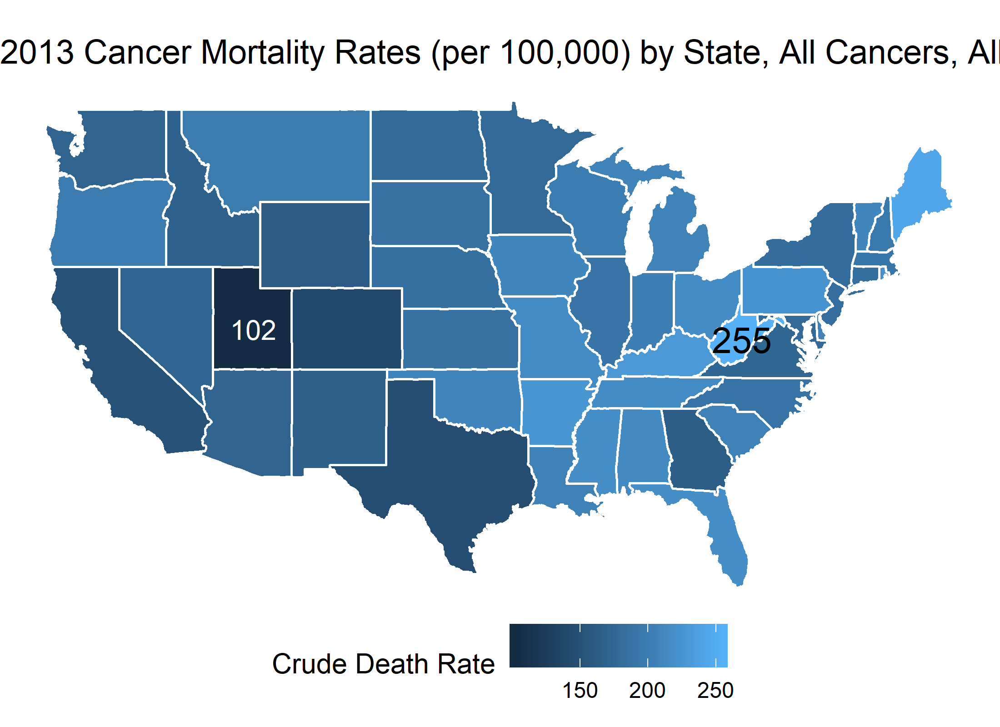

<!-- These two chunks should be added in the beginning of every .Rmd that you want to source an .R script -->
<!--  The 1st mandatory chunck  -->
<!--  Set the working directory to the repository's base directory -->


<!--  The 2nd mandatory chunck  -->
<!-- Set the report-wide options, and point to the external code file. -->


<!-- Load packages to be used in this report. --> 

```r
# Attach these packages so their functions don't need to be qualified: http://r-pkgs.had.co.nz/namespace.html#search-path
library(magrittr) # enables piping : %>%
library(dplyr)    # data wrangling
library(ggplot2)  # graphs
library(tidyr)    # data tidying
library(maps)
```

```
Warning: package 'maps' was built under R version 3.6.3
```


<!-- Load the sources.  Suppress the output when loading sources. --> 

```r
# Call `base::source()` on any repo file that defines functions needed below.
# source("./scripts/common-functions.R") # used in multiple reports
# source("./scripts/graphing/graph-presets.R") # fonts, colors, themes
```


<!-- Load any Global functions and variables declared in the R file.  Suppress the output. --> 


<!-- Declare any global functions specific to a Rmd output.  Suppress the output. --> 

```r
#Put code in here.  It doesn't call a chunk in the codebehind file.
```
# Load Data
<!-- Load the datasets.   -->

```r
path_file <- "./data-public/raw/Tableau_10_Training_Files/Tableau 10 Training Practice Data.xlsx"
sheet_names <- readxl::excel_sheets(path_file)
dto <- list()
for(sheet_i in sheet_names){
  # i <- sheet_names[1]
  dto[[sheet_i]] <- readxl::read_xlsx(path_file, sheet = sheet_i)
}
ds_cancer_deaths <- dto$`13 - Cancer Deaths by State`

ds_usa <- ggplot2::map_data('state') %>% tibble::as_tibble()
```

<!-- Inspect the datasets.   -->

```r
ds_cancer_deaths %>% glimpse()
```

```
Observations: 51
Variables: 6
$ State                <chr> "Alabama", "Alaska", "Arizona", "Arkansas", "California", "Colorado", "Connecticut", "...
$ Gender               <chr> "Both", "Both", "Both", "Both", "Both", "Both", "Both", "Both", "Both", "Both", "Both"...
$ Year                 <dbl> 2013, 2013, 2013, 2013, 2013, 2013, 2013, 2013, 2013, 2013, 2013, 2013, 2013, 2013, 20...
$ `Deaths (count)`     <dbl> 10328, 1016, 11347, 6688, 57714, 7357, 6619, 1905, 1095, 42734, 16417, 2332, 2707, 244...
$ `Population (count)` <dbl> 4833996, 737259, 6634997, 2958765, 38431393, 5272086, 3599341, 925240, 649111, 1960031...
$ `Crude Death Rate`   <dbl> 213.7, 137.8, 171.0, 226.0, 150.2, 139.5, 183.9, 205.9, 168.7, 218.0, 164.3, 165.5, 16...
```

# Tweak Data
<!-- Tweak the datasets.   -->

```r
names(ds_cancer_deaths) <- c(
  "state"
  ,"gender"
  ,"year"
  ,"n_death_cancer"
  ,"n_population"
  ,"rate_death_cancer"
)

ds_cancer_map <- dplyr::inner_join(
  ds_cancer_deaths %>% dplyr::mutate(state = tolower(state))
  ,ds_usa
  , by = c("state" = "region")
)
```


```r
g1 <- ds_cancer_map %>%
  ggplot(aes(x = long, y = lat, group = group, fill = rate_death_cancer ))+
  geom_polygon( color = "white")+
  annotate("text", x =-111.5 , y = 39 ,  label = "102", color = "white")+
  annotate("text", x =-80.5 , y = 38.5 ,  label = "255", color = "black", size = 5)+
  coord_map()+
  theme_void()+
  # theme_minimal()+
  scale_x_continuous(breaks = seq(-120,-60,10))+
  theme(
    legend.position = "bottom"
  )+
  labs(
    title = "2013 Cancer Mortality Rates (per 100,000) by State, All Cancers, All Patients"
    ,fill = "Crude Death Rate"
  )
g1
```



```r
ds_cancer_deaths %>%
  distinct(state, rate_death_cancer) %>%
  arrange(rate_death_cancer) %>%
  knitr::kable()
```


state                   rate_death_cancer
---------------------  ------------------
Utah                                102.3
Alaska                              137.8
Colorado                            139.5
Texas                               144.9
California                          150.2
Wyoming                             162.2
Georgia                             164.3
Hawaii                              165.5
New Mexico                          166.8
Idaho                               167.8
District of Columbia                168.7
Arizona                             171.0
Washington                          171.0
Nevada                              172.6
Virginia                            174.3
Minnesota                           177.1
North Dakota                        177.7
Maryland                            178.6
New York                            181.4
New Jersey                          183.1
Connecticut                         183.9
Nebraska                            185.1
Kansas                              185.8
South Dakota                        186.5
North Carolina                      188.7
Illinois                            190.0
Massachusetts                       191.7
New Hampshire                       195.4
Montana                             196.8
Oregon                              198.5
Wisconsin                           198.9
Indiana                             201.8
Louisiana                           203.5
South Carolina                      204.2
Michigan                            205.8
Delaware                            205.9
Oklahoma                            208.6
Vermont                             210.3
Iowa                                210.5
Alabama                             213.7
Missouri                            214.3
Tennessee                           214.8
Ohio                                215.9
Florida                             218.0
Mississippi                         218.1
Rhode Island                        220.8
Pennsylvania                        223.1
Arkansas                            226.0
Kentucky                            229.2
Maine                               242.9
West Virginia                       254.5

```r
ds_cancer_map %>%
  group_by(state) %>%
  summarize(
    x_center = median(long, na.rm = T)
    , y_center = median(lat, na.rm =T)
  ) %>%
  filter(state == "west virginia")
```

```
# A tibble: 1 x 3
  state         x_center y_center
  <chr>            <dbl>    <dbl>
1 west virginia    -80.5     38.9
```


<!-- Basic table view.   -->


<!-- Basic graph view.   -->


session information
===========================================================================

For the sake of documentation and reproducibility, the current report was rendered in the following environment.  Click the line below to expand.

<details>
  <summary>Environment <span class="glyphicon glyphicon-plus-sign"></span></summary>

```
- Session info -------------------------------------------------------------------------------------------------------
 setting  value                       
 version  R version 3.6.2 (2019-12-12)
 os       Windows 10 x64              
 system   x86_64, mingw32             
 ui       RTerm                       
 language (EN)                        
 collate  English_United States.1252  
 ctype    English_United States.1252  
 tz       America/New_York            
 date     2020-04-08                  

- Packages -----------------------------------------------------------------------------------------------------------
 package     * version date       lib source        
 assertthat    0.2.1   2019-03-21 [1] CRAN (R 3.6.2)
 backports     1.1.5   2019-10-02 [1] CRAN (R 3.6.1)
 callr         3.4.2   2020-02-12 [1] CRAN (R 3.6.2)
 cellranger    1.1.0   2016-07-27 [1] CRAN (R 3.6.2)
 cli           2.0.1   2020-01-08 [1] CRAN (R 3.6.2)
 colorspace    1.4-1   2019-03-18 [1] CRAN (R 3.6.1)
 crayon        1.3.4   2017-09-16 [1] CRAN (R 3.6.2)
 desc          1.2.0   2018-05-01 [1] CRAN (R 3.6.2)
 devtools      2.2.2   2020-02-17 [1] CRAN (R 3.6.3)
 digest        0.6.24  2020-02-12 [1] CRAN (R 3.6.2)
 dplyr       * 0.8.4   2020-01-31 [1] CRAN (R 3.6.2)
 ellipsis      0.3.0   2019-09-20 [1] CRAN (R 3.6.2)
 evaluate      0.14    2019-05-28 [1] CRAN (R 3.6.2)
 fansi         0.4.1   2020-01-08 [1] CRAN (R 3.6.2)
 farver        2.0.3   2020-01-16 [1] CRAN (R 3.6.2)
 fs            1.3.1   2019-05-06 [1] CRAN (R 3.6.2)
 ggplot2     * 3.2.1   2019-08-10 [1] CRAN (R 3.6.2)
 glue          1.3.1   2019-03-12 [1] CRAN (R 3.6.2)
 gtable        0.3.0   2019-03-25 [1] CRAN (R 3.6.2)
 highr         0.8     2019-03-20 [1] CRAN (R 3.6.2)
 htmltools     0.4.0   2019-10-04 [1] CRAN (R 3.6.2)
 knitr       * 1.28    2020-02-06 [1] CRAN (R 3.6.2)
 labeling      0.3     2014-08-23 [1] CRAN (R 3.6.0)
 lazyeval      0.2.2   2019-03-15 [1] CRAN (R 3.6.2)
 lifecycle     0.1.0   2019-08-01 [1] CRAN (R 3.6.2)
 magrittr    * 1.5     2014-11-22 [1] CRAN (R 3.6.2)
 mapproj       1.2.7   2020-02-03 [1] CRAN (R 3.6.3)
 maps        * 3.3.0   2018-04-03 [1] CRAN (R 3.6.3)
 memoise       1.1.0   2017-04-21 [1] CRAN (R 3.6.2)
 munsell       0.5.0   2018-06-12 [1] CRAN (R 3.6.2)
 pillar        1.4.3   2019-12-20 [1] CRAN (R 3.6.2)
 pkgbuild      1.0.6   2019-10-09 [1] CRAN (R 3.6.2)
 pkgconfig     2.0.3   2019-09-22 [1] CRAN (R 3.6.2)
 pkgload       1.0.2   2018-10-29 [1] CRAN (R 3.6.2)
 prettyunits   1.1.1   2020-01-24 [1] CRAN (R 3.6.2)
 processx      3.4.2   2020-02-09 [1] CRAN (R 3.6.2)
 ps            1.3.2   2020-02-13 [1] CRAN (R 3.6.2)
 purrr         0.3.3   2019-10-18 [1] CRAN (R 3.6.2)
 R6            2.4.1   2019-11-12 [1] CRAN (R 3.6.2)
 Rcpp          1.0.3   2019-11-08 [1] CRAN (R 3.6.2)
 readxl        1.3.1   2019-03-13 [1] CRAN (R 3.6.2)
 remotes       2.1.1   2020-02-15 [1] CRAN (R 3.6.2)
 rlang         0.4.4   2020-01-28 [1] CRAN (R 3.6.2)
 rmarkdown     2.1     2020-01-20 [1] CRAN (R 3.6.2)
 rprojroot     1.3-2   2018-01-03 [1] CRAN (R 3.6.2)
 scales        1.1.0   2019-11-18 [1] CRAN (R 3.6.2)
 sessioninfo   1.1.1   2018-11-05 [1] CRAN (R 3.6.2)
 stringi       1.4.5   2020-01-11 [1] CRAN (R 3.6.2)
 stringr       1.4.0   2019-02-10 [1] CRAN (R 3.6.2)
 testthat      2.3.1   2019-12-01 [1] CRAN (R 3.6.2)
 tibble        2.1.3   2019-06-06 [1] CRAN (R 3.6.2)
 tidyr       * 1.0.2   2020-01-24 [1] CRAN (R 3.6.2)
 tidyselect    1.0.0   2020-01-27 [1] CRAN (R 3.6.2)
 usethis       1.5.1   2019-07-04 [1] CRAN (R 3.6.2)
 utf8          1.1.4   2018-05-24 [1] CRAN (R 3.6.2)
 vctrs         0.2.2   2020-01-24 [1] CRAN (R 3.6.2)
 withr         2.1.2   2018-03-15 [1] CRAN (R 3.6.2)
 xfun          0.12    2020-01-13 [1] CRAN (R 3.6.2)
 yaml          2.2.1   2020-02-01 [1] CRAN (R 3.6.2)

[1] C:/Users/an499583/Documents/R/win-library/3.6
[2] C:/Program Files/R/R-3.6.2/library
```


