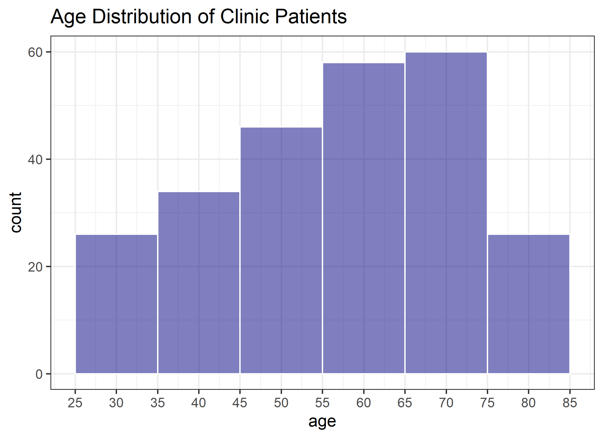
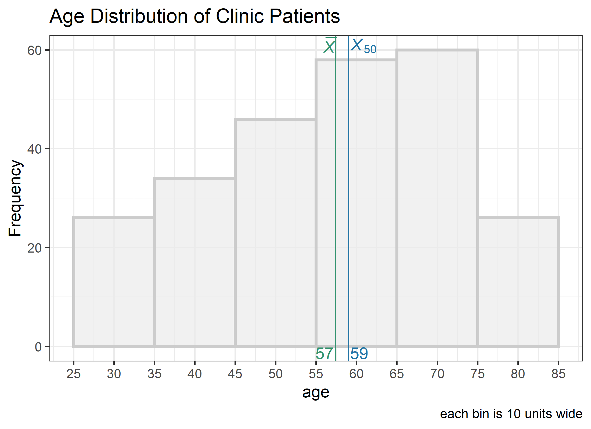
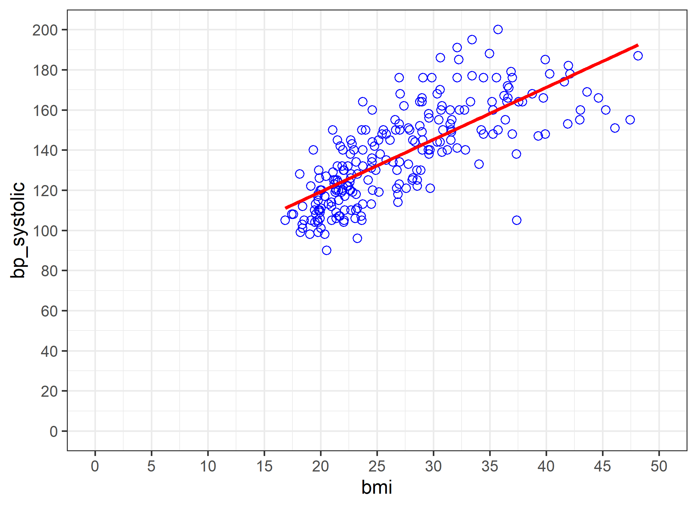
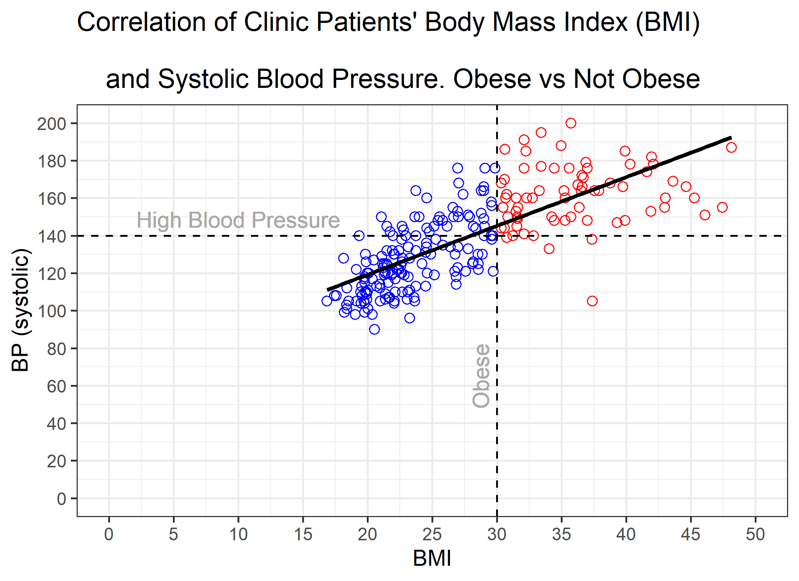

<!-- These two chunks should be added in the beginning of every .Rmd that you want to source an .R script -->
<!--  The 1st mandatory chunck  -->
<!--  Set the working directory to the repository's base directory -->


<!--  The 2nd mandatory chunck  -->
<!-- Set the report-wide options, and point to the external code file. -->


<!-- Load 'sourced' R files.  Suppress the output when loading packages. --> 

```r
# Attach these packages so their functions don't need to be qualified: http://r-pkgs.had.co.nz/namespace.html#search-path
library(magrittr) # enables piping : %>%
library(dplyr)    # data wrangling
library(ggplot2)  # graphs
library(tidyr)    # data tidying
```


<!-- Load the sources.  Suppress the output when loading sources. --> 

```r
# Call `base::source()` on any repo file that defines functions needed below.
source("./scripts/common-functions.R") # used in multiple reports
source("./scripts/graphing/graph-presets.R") # fonts, colors, themes
```


<!-- Load any Global functions and variables declared in the R file.  Suppress the output. --> 


<!-- Declare any global functions specific to a Rmd output.  Suppress the output. --> 

```r
#Put code in here.  It doesn't call a chunk in the codebehind file.
```
# Load Data
<!-- Load the datasets.   -->

```r
path_file <- "./data-public/raw/Tableau_10_Training_Files/Tableau 10 Training Practice Data.xlsx"
sheet_names <- readxl::excel_sheets(path_file)
dto <- list()
for(sheet_i in sheet_names){
  # i <- sheet_names[1]
  dto[[sheet_i]] <- readxl::read_xlsx(path_file, sheet = sheet_i)
}
ds_patient_metrics <- dto$`04 - Clinic Patients Metrics`
```

<!-- Inspect the datasets.   -->

```r
ds_patient_metrics %>% glimpse(60)
```

```
Observations: 250
Variables: 6
$ `Patient ID`     <dbl> 1, 2, 3, 4, 5, 6, 7, 8, 9, 10,...
$ `BP (diastolic)` <dbl> 110, 74, 95, 90, 90, 86, 78, 1...
$ `BP (systolic)`  <dbl> 160, 145, 150, 135, 145, 176, ...
$ `Height (cm)`    <dbl> 166.0, 172.7, 209.0, 174.9, 17...
$ `Weight (kg)`    <dbl> 89, 75, 92, 79, 82, 96, 66, 88...
$ Age              <dbl> 69, 48, 70, 33, 69, 67, 50, 51...
```

# Tweak Data
<!-- Tweak the datasets.   -->

```r
ds1 <- ds_patient_metrics
names(ds1) <- c("patient_id","bp_diastolic", "bp_systolic", "height_cm", "weight_kg","age")
ds1 %>% glimpse(60)
```

```
Observations: 250
Variables: 6
$ patient_id   <dbl> 1, 2, 3, 4, 5, 6, 7, 8, 9, 10, 11,...
$ bp_diastolic <dbl> 110, 74, 95, 90, 90, 86, 78, 100, ...
$ bp_systolic  <dbl> 160, 145, 150, 135, 145, 176, 122,...
$ height_cm    <dbl> 166.0, 172.7, 209.0, 174.9, 177.1,...
$ weight_kg    <dbl> 89, 75, 92, 79, 82, 96, 66, 88, 82...
$ age          <dbl> 69, 48, 70, 33, 69, 67, 50, 51, 40...
```

# Histogram

```r
# creat a graph showing the age distribution of patients
g1 <- ds1 %>%
  ggplot(aes(x = age))+
  geom_histogram(binwidth = 10, color = "white", fill = "navyblue", alpha = .5)+
  scale_x_continuous(breaks = seq(20,90, 5))+
  labs(title = "Age Distribution of Clinic Patients")+
  theme_bw()
g1
```



If you don't intend to customize a histogram much, consider used a canned graph from `TabularManifest` package


```r
g1a <- ds1 %>%
  TabularManifest::histogram_continuous("age", bin_width = 10)+
  scale_x_continuous(breaks = seq(20,90, 5))+
  labs(title = "Age Distribution of Clinic Patients")+
  theme_bw()
g1a
```



# Scatterplot

```r
ds2 <- ds1 %>%
  dplyr::mutate(
    bmi = weight_kg/ ((height_cm / 100)^2)
  )
ds2 %>% glimpse(60)
```

```
Observations: 250
Variables: 7
$ patient_id   <dbl> 1, 2, 3, 4, 5, 6, 7, 8, 9, 10, 11,...
$ bp_diastolic <dbl> 110, 74, 95, 90, 90, 86, 78, 100, ...
$ bp_systolic  <dbl> 160, 145, 150, 135, 145, 176, 122,...
$ height_cm    <dbl> 166.0, 172.7, 209.0, 174.9, 177.1,...
$ weight_kg    <dbl> 89, 75, 92, 79, 82, 96, 66, 88, 82...
$ age          <dbl> 69, 48, 70, 33, 69, 67, 50, 51, 40...
$ bmi          <dbl> 32.29787, 25.14644, 21.06179, 25.8...
```

```r
g2 <- ds2 %>%
  ggplot(aes(x = bmi, y = bp_systolic))+
  geom_point(shape = 21, size = 2, color = "blue")+
  scale_x_continuous(breaks = seq(0,50,5), limits = c(0,50))+
  scale_y_continuous(breaks = seq(0,200,20), limits = c(0,200))+
  geom_smooth(method = "lm", se = F, color = "red")+
  theme_bw()
g2
```



Let's augment the graph with informative thresholds:


```r
threshold_obesity_bmi <- 30
threshold_highbp_systolic <- 140
threshold_highbp_diastolic <- 90

g2 <- ds2 %>%
  dplyr::mutate(
    bmi = weight_kg/ ((height_cm / 100)^2)
  ) %>%
  ggplot(aes(x = bmi, y = bp_systolic))+
  geom_point(aes(color = bmi >= 30),shape = 21, size = 2, show.legend = F)+
  scale_color_manual(values = c("TRUE" = "red","FALSE" = "blue"))+
  # geom_point(aes(color = bmi >= 30),shape = 21, size = 2, color = "blue")+
  scale_x_continuous(breaks = seq(0,50,5), limits = c(0,50))+
  scale_y_continuous(breaks = seq(0,200,20), limits = c(0,200))+
  geom_smooth(method = "lm", se = F, color = "black")+
  geom_vline(xintercept = threshold_obesity_bmi, linetype = "dashed" )+
  geom_text(x = 10, y = 140, label = "High Blood Pressure", vjust = -0.5, color = "darkgrey") +
  geom_hline(yintercept = threshold_highbp_systolic, linetype = "dashed" )+
  geom_text(x = 30,y = 65, label = "Obese", angle = 90, vjust = -0.5,color = "darkgrey") +
  labs(
    title = "Correlation of Clinic Patients' Body Mass Index (BMI) \n
    and Systolic Blood Pressure. Obese vs Not Obese",
    x = "BMI", y = "BP (systolic)"
  )+
  theme_bw()
g2
```




<!-- Basic table view.   -->


<!-- Basic graph view.   -->


session information
===========================================================================

For the sake of documentation and reproducibility, the current report was rendered in the following environment.  Click the line below to expand.

<details>
  <summary>Environment <span class="glyphicon glyphicon-plus-sign"></span></summary>

```
- Session info -------------------------------------------------------------------------------------------------------
 setting  value                       
 version  R version 3.6.2 (2019-12-12)
 os       Windows 10 x64              
 system   x86_64, mingw32             
 ui       RTerm                       
 language (EN)                        
 collate  English_United States.1252  
 ctype    English_United States.1252  
 tz       America/New_York            
 date     2020-03-12                  

- Packages -----------------------------------------------------------------------------------------------------------
 package         * version     date       lib source                                  
 assertthat        0.2.1       2019-03-21 [1] CRAN (R 3.6.2)                          
 backports         1.1.5       2019-10-02 [1] CRAN (R 3.6.1)                          
 callr             3.4.2       2020-02-12 [1] CRAN (R 3.6.2)                          
 cellranger        1.1.0       2016-07-27 [1] CRAN (R 3.6.2)                          
 cli               2.0.1       2020-01-08 [1] CRAN (R 3.6.2)                          
 colorspace        1.4-1       2019-03-18 [1] CRAN (R 3.6.1)                          
 crayon            1.3.4       2017-09-16 [1] CRAN (R 3.6.2)                          
 desc              1.2.0       2018-05-01 [1] CRAN (R 3.6.2)                          
 devtools          2.2.2       2020-02-17 [1] CRAN (R 3.6.3)                          
 dichromat       * 2.0-0       2013-01-24 [1] CRAN (R 3.6.0)                          
 digest            0.6.24      2020-02-12 [1] CRAN (R 3.6.2)                          
 dplyr           * 0.8.4       2020-01-31 [1] CRAN (R 3.6.2)                          
 ellipsis          0.3.0       2019-09-20 [1] CRAN (R 3.6.2)                          
 evaluate          0.14        2019-05-28 [1] CRAN (R 3.6.2)                          
 fansi             0.4.1       2020-01-08 [1] CRAN (R 3.6.2)                          
 farver            2.0.3       2020-01-16 [1] CRAN (R 3.6.2)                          
 fs                1.3.1       2019-05-06 [1] CRAN (R 3.6.2)                          
 ggplot2         * 3.2.1       2019-08-10 [1] CRAN (R 3.6.2)                          
 glue              1.3.1       2019-03-12 [1] CRAN (R 3.6.2)                          
 gtable            0.3.0       2019-03-25 [1] CRAN (R 3.6.2)                          
 htmltools         0.4.0       2019-10-04 [1] CRAN (R 3.6.2)                          
 knitr           * 1.28        2020-02-06 [1] CRAN (R 3.6.2)                          
 labeling          0.3         2014-08-23 [1] CRAN (R 3.6.0)                          
 lazyeval          0.2.2       2019-03-15 [1] CRAN (R 3.6.2)                          
 lifecycle         0.1.0       2019-08-01 [1] CRAN (R 3.6.2)                          
 magrittr        * 1.5         2014-11-22 [1] CRAN (R 3.6.2)                          
 memoise           1.1.0       2017-04-21 [1] CRAN (R 3.6.2)                          
 munsell           0.5.0       2018-06-12 [1] CRAN (R 3.6.2)                          
 pillar            1.4.3       2019-12-20 [1] CRAN (R 3.6.2)                          
 pkgbuild          1.0.6       2019-10-09 [1] CRAN (R 3.6.2)                          
 pkgconfig         2.0.3       2019-09-22 [1] CRAN (R 3.6.2)                          
 pkgload           1.0.2       2018-10-29 [1] CRAN (R 3.6.2)                          
 prettyunits       1.1.1       2020-01-24 [1] CRAN (R 3.6.2)                          
 processx          3.4.2       2020-02-09 [1] CRAN (R 3.6.2)                          
 ps                1.3.2       2020-02-13 [1] CRAN (R 3.6.2)                          
 purrr             0.3.3       2019-10-18 [1] CRAN (R 3.6.2)                          
 R6                2.4.1       2019-11-12 [1] CRAN (R 3.6.2)                          
 RColorBrewer    * 1.1-2       2014-12-07 [1] CRAN (R 3.6.0)                          
 Rcpp              1.0.3       2019-11-08 [1] CRAN (R 3.6.2)                          
 readxl            1.3.1       2019-03-13 [1] CRAN (R 3.6.2)                          
 remotes           2.1.1       2020-02-15 [1] CRAN (R 3.6.2)                          
 rlang             0.4.4       2020-01-28 [1] CRAN (R 3.6.2)                          
 rmarkdown         2.1         2020-01-20 [1] CRAN (R 3.6.2)                          
 rprojroot         1.3-2       2018-01-03 [1] CRAN (R 3.6.2)                          
 scales            1.1.0       2019-11-18 [1] CRAN (R 3.6.2)                          
 sessioninfo       1.1.1       2018-11-05 [1] CRAN (R 3.6.2)                          
 stringi           1.4.5       2020-01-11 [1] CRAN (R 3.6.2)                          
 stringr           1.4.0       2019-02-10 [1] CRAN (R 3.6.2)                          
 TabularManifest   0.1-16.9003 2020-02-17 [1] Github (Melinae/TabularManifest@4cbc21c)
 testthat          2.3.1       2019-12-01 [1] CRAN (R 3.6.2)                          
 tibble            2.1.3       2019-06-06 [1] CRAN (R 3.6.2)                          
 tidyr           * 1.0.2       2020-01-24 [1] CRAN (R 3.6.2)                          
 tidyselect        1.0.0       2020-01-27 [1] CRAN (R 3.6.2)                          
 usethis           1.5.1       2019-07-04 [1] CRAN (R 3.6.2)                          
 utf8              1.1.4       2018-05-24 [1] CRAN (R 3.6.2)                          
 vctrs             0.2.2       2020-01-24 [1] CRAN (R 3.6.2)                          
 withr             2.1.2       2018-03-15 [1] CRAN (R 3.6.2)                          
 xfun              0.12        2020-01-13 [1] CRAN (R 3.6.2)                          
 yaml              2.2.1       2020-02-01 [1] CRAN (R 3.6.2)                          

[1] C:/Users/an499583/Documents/R/win-library/3.6
[2] C:/Program Files/R/R-3.6.2/library
```


