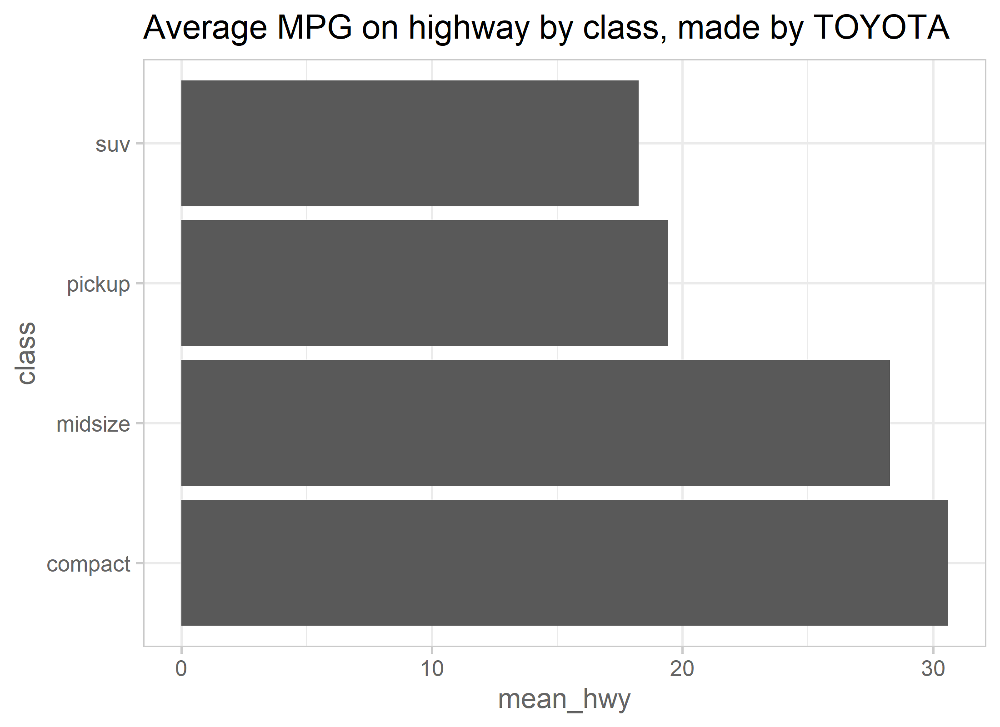

<!-- These two chunks should be added in the beginning of every .Rmd that you want to source an .R script -->
<!--  The 1st mandatory chunck  -->
<!--  Set the working directory to the repository's base directory -->


<!--  The 2nd mandatory chunck  -->
<!-- Set the report-wide options, and point to the external code file. -->


# Environment

<!-- Load 'sourced' R files.  Suppress the output when loading packages. --> 


<!-- Load the sources.  Suppress the output when loading sources. --> 


<!-- Load any Global functions and variables declared in the R file.  Suppress the output. --> 


<!-- Declare any global functions specific to a Rmd output.  Suppress the output. --> 


# Load Data
<!-- Load the datasets.   -->


<!-- Inspect the datasets.   -->

```
Observations: 234
Variables: 11
$ manufacturer <chr> "audi", "audi", "audi", "audi", "a...
$ model        <chr> "a4", "a4", "a4", "a4", "a4", "a4"...
$ displ        <dbl> 1.8, 1.8, 2.0, 2.0, 2.8, 2.8, 3.1,...
$ year         <int> 1999, 1999, 2008, 2008, 1999, 1999...
$ cyl          <int> 4, 4, 4, 4, 6, 6, 6, 4, 4, 4, 4, 6...
$ trans        <chr> "auto(l5)", "manual(m5)", "manual(...
$ drv          <chr> "f", "f", "f", "f", "f", "f", "f",...
$ cty          <int> 18, 21, 20, 21, 16, 18, 18, 18, 16...
$ hwy          <int> 29, 29, 31, 30, 26, 26, 27, 26, 25...
$ fl           <chr> "p", "p", "p", "p", "p", "p", "p",...
$ class        <chr> "compact", "compact", "compact", "...
```

```
# A tibble: 15 x 2
# Groups:   manufacturer [15]
   manufacturer     n
   <chr>        <int>
 1 audi            18
 2 chevrolet       19
 3 dodge           37
 4 ford            25
 5 honda            9
 6 hyundai         14
 7 jeep             8
 8 land rover       4
 9 lincoln          3
10 mercury          4
11 nissan          13
12 pontiac          5
13 subaru          14
14 toyota          34
15 volkswagen      27
```

```
# A tibble: 7 x 2
# Groups:   class [7]
  class          n
  <chr>      <int>
1 2seater        5
2 compact       47
3 midsize       41
4 minivan       11
5 pickup        33
6 subcompact    35
7 suv           62
```
# Tweak Data
<!-- Tweak the datasets.   -->

```
# A tibble: 7 x 2
# Groups:   class [7]
  class          n
  <chr>      <int>
1 compact       47
2 midsize       41
3 minivan       11
4 pickup        33
5 subcompact    35
6 suv           62
7 twoseater      5
```


# Table 1
<!-- Basic table view.   -->

```r
# show how many cars are represented by each manufacturer and what their mean mpg on highway is
d1 <- ds1 %>%
  # filter(manufacturer == "ford") %>%
  # filter(manufacturer == "toyota") %>%
  filter(manufacturer == select_manufacturer) %>%
  dplyr::group_by(class) %>%
  summarize(
    n = n()
    ,mean_hwy = mean(hwy, nr.rm = T)
  )
d1 %>% knitr::kable(format = "pandoc",digits = 1)
```


class       n   mean_hwy
--------  ---  ---------
compact    12       30.6
midsize     7       28.3
pickup      7       19.4
suv         8       18.2

# Graph 1
<!-- Basic graph view.   -->

```r
d1 %>%
  ggplot( aes(x = class, y = mean_hwy) )+
  geom_col()+
  coord_flip()+
  labs(
    title = paste0("Average MPG on highway by class, made by ", toupper(select_manufacturer) )
  )+
  main_theme
```



session information
===========================================================================

For the sake of documentation and reproducibility, the current report was rendered in the following environment.  Click the line below to expand.

<details>
  <summary>Environment <span class="glyphicon glyphicon-plus-sign"></span></summary>

```
- Session info -------------------------------------------------------------------------------------------------------
 setting  value                       
 version  R version 3.6.2 (2019-12-12)
 os       Windows 10 x64              
 system   x86_64, mingw32             
 ui       RTerm                       
 language (EN)                        
 collate  English_United States.1252  
 ctype    English_United States.1252  
 tz       America/New_York            
 date     2020-04-01                  

- Packages -----------------------------------------------------------------------------------------------------------
 package      * version date       lib source        
 assertthat     0.2.1   2019-03-21 [1] CRAN (R 3.6.2)
 backports      1.1.5   2019-10-02 [1] CRAN (R 3.6.1)
 callr          3.4.2   2020-02-12 [1] CRAN (R 3.6.2)
 cli            2.0.1   2020-01-08 [1] CRAN (R 3.6.2)
 colorspace     1.4-1   2019-03-18 [1] CRAN (R 3.6.1)
 crayon         1.3.4   2017-09-16 [1] CRAN (R 3.6.2)
 desc           1.2.0   2018-05-01 [1] CRAN (R 3.6.2)
 devtools       2.2.2   2020-02-17 [1] CRAN (R 3.6.3)
 dichromat    * 2.0-0   2013-01-24 [1] CRAN (R 3.6.0)
 digest         0.6.24  2020-02-12 [1] CRAN (R 3.6.2)
 dplyr        * 0.8.4   2020-01-31 [1] CRAN (R 3.6.2)
 ellipsis       0.3.0   2019-09-20 [1] CRAN (R 3.6.2)
 evaluate       0.14    2019-05-28 [1] CRAN (R 3.6.2)
 fansi          0.4.1   2020-01-08 [1] CRAN (R 3.6.2)
 farver         2.0.3   2020-01-16 [1] CRAN (R 3.6.2)
 fs             1.3.1   2019-05-06 [1] CRAN (R 3.6.2)
 ggplot2      * 3.2.1   2019-08-10 [1] CRAN (R 3.6.2)
 glue           1.3.1   2019-03-12 [1] CRAN (R 3.6.2)
 gtable         0.3.0   2019-03-25 [1] CRAN (R 3.6.2)
 highr          0.8     2019-03-20 [1] CRAN (R 3.6.2)
 htmltools      0.4.0   2019-10-04 [1] CRAN (R 3.6.2)
 knitr        * 1.28    2020-02-06 [1] CRAN (R 3.6.2)
 labeling       0.3     2014-08-23 [1] CRAN (R 3.6.0)
 lazyeval       0.2.2   2019-03-15 [1] CRAN (R 3.6.2)
 lifecycle      0.1.0   2019-08-01 [1] CRAN (R 3.6.2)
 magrittr     * 1.5     2014-11-22 [1] CRAN (R 3.6.2)
 memoise        1.1.0   2017-04-21 [1] CRAN (R 3.6.2)
 munsell        0.5.0   2018-06-12 [1] CRAN (R 3.6.2)
 pillar         1.4.3   2019-12-20 [1] CRAN (R 3.6.2)
 pkgbuild       1.0.6   2019-10-09 [1] CRAN (R 3.6.2)
 pkgconfig      2.0.3   2019-09-22 [1] CRAN (R 3.6.2)
 pkgload        1.0.2   2018-10-29 [1] CRAN (R 3.6.2)
 prettyunits    1.1.1   2020-01-24 [1] CRAN (R 3.6.2)
 processx       3.4.2   2020-02-09 [1] CRAN (R 3.6.2)
 ps             1.3.2   2020-02-13 [1] CRAN (R 3.6.2)
 purrr          0.3.3   2019-10-18 [1] CRAN (R 3.6.2)
 R6             2.4.1   2019-11-12 [1] CRAN (R 3.6.2)
 RColorBrewer * 1.1-2   2014-12-07 [1] CRAN (R 3.6.0)
 Rcpp           1.0.3   2019-11-08 [1] CRAN (R 3.6.2)
 remotes        2.1.1   2020-02-15 [1] CRAN (R 3.6.2)
 rlang          0.4.4   2020-01-28 [1] CRAN (R 3.6.2)
 rmarkdown      2.1     2020-01-20 [1] CRAN (R 3.6.2)
 rprojroot      1.3-2   2018-01-03 [1] CRAN (R 3.6.2)
 scales         1.1.0   2019-11-18 [1] CRAN (R 3.6.2)
 sessioninfo    1.1.1   2018-11-05 [1] CRAN (R 3.6.2)
 stringi        1.4.5   2020-01-11 [1] CRAN (R 3.6.2)
 stringr        1.4.0   2019-02-10 [1] CRAN (R 3.6.2)
 testthat       2.3.1   2019-12-01 [1] CRAN (R 3.6.2)
 tibble         2.1.3   2019-06-06 [1] CRAN (R 3.6.2)
 tidyr        * 1.0.2   2020-01-24 [1] CRAN (R 3.6.2)
 tidyselect     1.0.0   2020-01-27 [1] CRAN (R 3.6.2)
 usethis        1.5.1   2019-07-04 [1] CRAN (R 3.6.2)
 utf8           1.1.4   2018-05-24 [1] CRAN (R 3.6.2)
 vctrs          0.2.2   2020-01-24 [1] CRAN (R 3.6.2)
 withr          2.1.2   2018-03-15 [1] CRAN (R 3.6.2)
 xfun           0.12    2020-01-13 [1] CRAN (R 3.6.2)
 yaml           2.2.1   2020-02-01 [1] CRAN (R 3.6.2)

[1] C:/Users/an499583/Documents/R/win-library/3.6
[2] C:/Program Files/R/R-3.6.2/library
```


